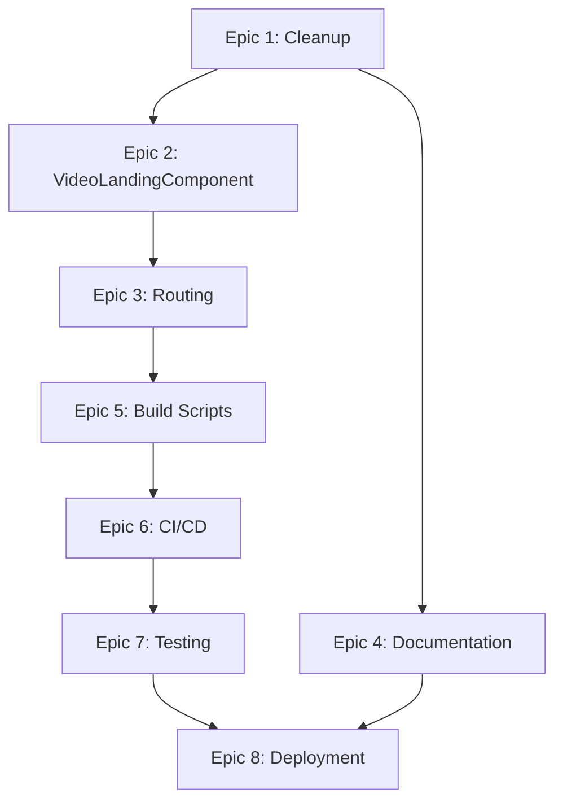

# AGILE3D Demo — Backup Video-Only Version: Micro-Level Implementation Plan

## Session Inputs Summary

### Approved Meso-Level Plan
The backup video-only branch removes all 3D point cloud code, assets, and dependencies, replacing the interactive demo with a single externally hosted embedded video. This version serves as a deadline-safe fallback for NSF presentation.

**Key Architectural Decisions:**
- Static Client-Only Web App served via CDN
- Minimal client layering: Presentation + optional Config Adapter
- Iframe embed from external video platform (YouTube/Vimeo)
- No 3D rendering, control panel, or metrics
- Retain existing build/test/lint infrastructure

### Constraints
- **Timeline**: ~1 business day delivery
- **External Video Hosting**: {YouTube | Vimeo} (provider TBD)
- **Static Hosting**: {GitHub_Pages | Netlify | Vercel}
- **Browser Support**: Modern WebKit- and Chromium-based browsers
- **No Observability**: Metrics/analytics explicitly excluded
- **Accessibility**: Deprioritized (basic semantics retained, not gating)

### Non-Functional Requirements
- **Performance**: Minimal footprint, no autoplay, lazy iframe loading
- **Privacy**: No first-party tracking; third-party behavior follows video provider
- **Responsive**: Fluid 16:9 aspect ratio container, mobile-friendly
- **Maintainability**: Single change point for video URL

### Open Questions and Blocked Decisions
1. **Final Video URL** (BLOCKS: CSP configuration, config.json schema, deployment)
   - **Proposed Assumption**: Use YouTube embed with privacy-enhanced domain `https://www.youtube-nocookie.com/embed/{VIDEO_ID}`
   - **Validation**: User provides VIDEO_ID before deployment or placeholder used for development

2. **Configuration Approach** (BLOCKS: component implementation, build process)
   - **Option A**: Inline constant in VideoLandingComponent
   - **Option B**: Static config.json fetched at runtime
   - **Proposed Assumption**: Option A (inline constant) for simplicity and 1-day timeline; no runtime swap needed
   - **Validation**: Confirm with user before Epic 2.1

3. **CSP Specifics** (BLOCKS: hosting configuration)
   - **Proposed Assumption**: Based on YouTube privacy-enhanced embed:
     - `frame-src 'self' https://www.youtube-nocookie.com;`
     - `img-src 'self' data: https://i.ytimg.com;`
   - **Validation**: Test in staging after video URL confirmed

4. **Edge Caching TTL** (NOT BLOCKING: can use defaults)
   - **Proposed Assumption**:
     - HTML: `Cache-Control: no-cache` (always revalidate)
     - CSS/JS (fingerprinted): `Cache-Control: public, max-age=31536000, immutable`
     - config.json (if used): `Cache-Control: public, max-age=300` (5 minutes)

---

## 1. Technology Stack and Version Pins

### 1.1 Core Technologies

| Technology | Version | Rationale | Alternatives Considered |
|------------|---------|-----------|------------------------|
| **Angular** | ≥17.0.0 (LTS) | Macro-plan specifies Angular; existing project scaffold; CLI simplifies build | **React**: Similar capability but requires refactor. **Svelte**: Lighter but learning curve. |
| **TypeScript** | ≥5.2.0 | Type safety; Angular standard; existing codebase uses TS | **JavaScript**: Loses type safety; not worth trade-off for small component. |
| **Node.js** | ≥20.x LTS | Required for Angular CLI; build process | **N/A**: Angular CLI dependency |
| **npm** | ≥10.x | Package manager; lockfile for reproducibility | **yarn/pnpm**: Equivalent but require team familiarity. |

### 1.2 Build & Development Tools

| Tool | Version | Purpose | Configuration |
|------|---------|---------|---------------|
| **Angular CLI** | ≥17.0.0 | Build, dev server, test runner | `angular.json` (existing) |
| **esbuild** | (via Angular CLI) | Fast bundler (Angular 17+ default) | Automatic via CLI |
| **TypeScript Compiler** | ≥5.2.0 | Type checking, transpilation | `tsconfig.json`, `tsconfig.app.json` |
| **ESLint** | ≥8.x | Linting (Angular standard) | `.eslintrc.json` (existing) |
| **Prettier** | ≥3.x | Code formatting | `.prettierrc` (existing) |
| **Jasmine** | ≥5.x | Unit test framework | `karma.conf.js` (existing) |
| **Karma** | ≥6.x | Test runner | `karma.conf.js` (existing) |
| **Brotli** | (system util) | Pre-compression for static assets | Build script via `brotli` CLI |

### 1.3 Removed Dependencies

The following 3D-related dependencies MUST be removed from `package.json`:

```json
// REMOVE from dependencies:
{
  "three": "^0.160.0",
  "angular-three": "^2.0.0",
  "@types/three": "^0.160.0"
}
```

**Validation**: Run `npm ls` after removal; ensure no dependency tree references to Three.js remain.

### 1.4 Retained Dependencies

Keep existing Angular core dependencies:
- `@angular/core`, `@angular/common`, `@angular/router`, `@angular/platform-browser`
- `rxjs` (for potential observables in config loading, if Option B chosen)
- `zone.js` (Angular requirement)

**Optional (if using Angular Material for future extensibility)**:
- `@angular/material` (≥17.x): If sliders/buttons needed in future
- **Recommendation**: Remove for this branch to minimize bundle; custom CSS sufficient for video embed

### 1.5 Deprecation & Upgrade Policy

- **Angular**: Follow Angular LTS schedule; this branch may not receive Angular major upgrades post-deployment
- **Browser Support**: Target last 2 major versions of Chrome, Edge, Safari, Firefox (defined in `.browserslistrc`)
- **Lockfile**: `package-lock.json` committed; no `npm update` without explicit approval

---

## 2. Repository Structure and Conventions

### 2.1 Directory Tree

```
agile3d-demo/
├── src/
│   ├── app/
│   │   ├── features/
│   │   │   └── video-landing/               # NEW: Single video component
│   │   │       ├── video-landing.component.ts
│   │   │       ├── video-landing.component.html
│   │   │       ├── video-landing.component.scss
│   │   │       └── video-landing.component.spec.ts
│   │   ├── core/                            # PRUNED: Remove 3D services
│   │   │   └── (no 3D services remain)
│   │   ├── app.component.ts                 # MODIFIED: Minimal shell
│   │   ├── app.component.html               # MODIFIED: Router outlet only
│   │   ├── app.config.ts                    # RETAINED: Basic DI config
│   │   └── app.routes.ts                    # MODIFIED: Route to VideoLanding
│   ├── assets/                              # PRUNED: Remove 3D assets
│   │   ├── config/                          # OPTIONAL: config.json if Option B
│   │   │   └── config.json
│   │   └── (scenes/, workers/ DELETED)
│   ├── styles/                              # RETAINED: Global styles
│   │   └── styles.scss
│   ├── index.html                           # RETAINED: Entry point
│   └── main.ts                              # RETAINED: Bootstrap
├── angular.json                             # RETAINED: Build config
├── tsconfig.json                            # RETAINED: TS config
├── package.json                             # MODIFIED: Remove 3D deps
├── package-lock.json                        # MODIFIED: Regenerated
├── .eslintrc.json                           # RETAINED: Linting rules
├── .prettierrc                              # RETAINED: Formatting rules
├── karma.conf.js                            # RETAINED: Test config
├── README.md                                # MODIFIED: Document video-only branch
└── dist/                                    # GENERATED: Build output (gitignored)
```

### 2.2 Naming Conventions

- **Components**: `kebab-case` filenames, `PascalCase` class names (Angular standard)
  - Example: `video-landing.component.ts` → `VideoLandingComponent`
- **Services**: `kebab-case.service.ts`, `PascalCase` class names
  - Example: `config.service.ts` → `ConfigService` (if Option B chosen)
- **CSS Classes**: `kebab-case` with BEM methodology
  - Example: `.video-container`, `.video-container__iframe`, `.video-container--loading`
- **Config Files**: `kebab-case.json` in `src/assets/config/`
  - Example: `config.json`

### 2.3 Code Style

- **TypeScript**: Enforce via ESLint + Prettier
  - Single quotes for strings
  - 2-space indentation
  - Semicolons required
  - Trailing commas in multiline
- **HTML**: Angular template syntax
  - Self-closing tags for void elements (``)
  - Attribute order: structural directives → properties → events → classes
- **CSS/SCSS**: BEM naming; avoid deep nesting (max 3 levels); variables for colors/spacing

### 2.4 Commit Message Convention

Follow Conventional Commits:
```
<type>(<scope>): <subject>

<body>

<footer>
```

**Types**: `feat`, `fix`, `chore`, `docs`, `refactor`, `test`, `style`

**Examples**:
- `feat(video-landing): add VideoLandingComponent with iframe embed`
- `chore(deps): remove Three.js and angular-three dependencies`
- `docs(readme): add backup video-only branch instructions`

**Required**: Each complete reply to user prompt includes a git commit with date/time/description (per user rule).

---

## 3. Build, Dependency, and Environment Setup

### 3.1 Package Manager and Lockfile Policy

- **Package Manager**: npm (existing project standard)
- **Lockfile**: `package-lock.json` committed and immutable
  - Changes only via `npm install <package>` or `npm uninstall <package>`
  - Never manually edit `package-lock.json`
- **Reproducibility**: `npm ci` (clean install) for CI/CD and fresh local setups

### 3.2 Build Targets and Scripts

Add/modify scripts in `package.json`:

```json
{
  "scripts": {
    "start": "ng serve --open",
    "build": "ng build --configuration production",
    "build:prod": "npm run build && npm run compress",
    "compress": "node scripts/compress-assets.js",
    "test": "ng test",
    "test:ci": "ng test --watch=false --browsers=ChromeHeadless --code-coverage",
    "lint": "ng lint",
    "format": "prettier --write \"src/**/*.{ts,html,scss,json}\"",
    "format:check": "prettier --check \"src/**/*.{ts,html,scss,json}\""
  }
}
```

**New Script**: `scripts/compress-assets.js`
- Purpose: Pre-compress HTML/CSS/JS with Brotli for CDN serving
- Implementation: See §3.5 below

### 3.3 Local Dev Bootstrap Steps

**Prerequisites**:
- Node.js ≥20.x LTS installed
- npm ≥10.x installed
- Git installed

**Setup Steps**:
1. Clone repository: `git clone <repo-url> && cd agile3d-demo`
2. Checkout backup branch: `git checkout backup-video-only`
3. Install dependencies: `npm ci`
4. Start dev server: `npm start`
5. Open browser: `http://localhost:4200` (auto-opens if `--open` flag used)

**Validation**: Dev server runs without errors; placeholder video (or final video if URL provided) renders at root route.

### 3.4 Cross-Platform Considerations

- **Node.js**: Use `.nvmrc` file to pin Node version (recommended: `20.11.0`)
  - Developers use `nvm use` to auto-switch
- **Line Endings**: `.gitattributes` enforces LF for text files
  ```
  * text=auto eol=lf
  *.{cmd,bat} text eol=crlf
  ```
- **Path Separators**: Use `path.join()` in Node scripts (avoid hardcoded `/` or `\`)

### 3.5 Compression Script

**File**: `scripts/compress-assets.js`

```javascript
const fs = require('fs');
const path = require('path');
const { execSync } = require('child_process');

const distDir = path.join(__dirname, '../dist/agile3d-demo/browser');
const extensions = ['.html', '.css', '.js', '.json'];

function compressFile(filePath) {
  try {
    execSync(`brotli -9 -o "${filePath}.br" "${filePath}"`, { stdio: 'inherit' });
    console.log(`Compressed: ${filePath}`);
  } catch (error) {
    console.error(`Failed to compress: ${filePath}`, error.message);
  }
}

function walkDir(dir) {
  const files = fs.readdirSync(dir);
  files.forEach(file => {
    const filePath = path.join(dir, file);
    const stat = fs.statSync(filePath);
    if (stat.isDirectory()) {
      walkDir(filePath);
    } else if (extensions.includes(path.extname(file))) {
      compressFile(filePath);
    }
  });
}

if (fs.existsSync(distDir)) {
  walkDir(distDir);
  console.log('Compression complete.');
} else {
  console.error('Build directory not found. Run `ng build` first.');
  process.exit(1);
}
```

**Usage**: Automatically invoked by `npm run build:prod`

---

## 4. Detailed Module/Component Specifications

### 4.1 VideoLandingComponent

**File**: `src/app/features/video-landing/video-landing.component.ts`

#### Purpose
Single-purpose component that renders the landing page with an externally hosted video iframe embed.

#### Responsibilities
- Display responsive 16:9 video embed
- Render accessible heading and optional description
- Handle iframe loading state (optional loading indicator)
- Provide fallback link if iframe blocked

#### Inputs/Outputs
- **Inputs**: None (video URL is internal constant or fetched from config)
- **Outputs**: None (no user interactions beyond video player controls)

#### Public Interface

```typescript
import { Component, OnInit, ChangeDetectionStrategy } from '@angular/core';
import { CommonModule } from '@angular/common';

@Component({
  selector: 'app-video-landing',
  standalone: true,
  imports: [CommonModule],
  templateUrl: './video-landing.component.html',
  styleUrls: ['./video-landing.component.scss'],
  changeDetection: ChangeDetectionStrategy.OnPush
})
export class VideoLandingComponent implements OnInit {
  // Configuration Approach A: Inline constant
  readonly videoConfig = {
    title: 'AGILE3D Demo Overview',
    embedUrl: 'https://www.youtube-nocookie.com/embed/{VIDEO_ID}',
    provider: 'youtube',
    allow: 'accelerometer; clipboard-write; encrypted-media; gyroscope; picture-in-picture; web-share',
    referrerPolicy: 'strict-origin-when-cross-origin'
  };

  // State
  iframeLoaded = false;

  ngOnInit(): void {
    // Optional: Preconnect to video domain for faster loading
    this.preconnectVideoHost();
  }

  onIframeLoad(): void {
    this.iframeLoaded = true;
  }

  private preconnectVideoHost(): void {
    const link = document.createElement('link');
    link.rel = 'preconnect';
    link.href = 'https://www.youtube-nocookie.com';
    document.head.appendChild(link);
  }
}
```

**Alternative (Configuration Approach B)**:
If using `config.json`, inject a `ConfigService`:

```typescript
export class VideoLandingComponent implements OnInit {
  videoConfig$ = this.configService.getVideoConfig();

  constructor(private configService: ConfigService) {}

  ngOnInit(): void {
    this.videoConfig$.subscribe(config => {
      // Handle config load; show loading state if pending
    });
  }
}
```

#### Data Contracts

**VideoConfig Interface** (if Option B):
```typescript
interface VideoConfig {
  title: string;
  embedUrl: string;
  provider: 'youtube' | 'vimeo' | 'other';
  allow: string;
  referrerPolicy: string;
}
```

**config.json Schema** (if Option B):
```json
{
  "$schema": "http://json-schema.org/draft-07/schema#",
  "type": "object",
  "properties": {
    "title": { "type": "string" },
    "embedUrl": { "type": "string", "format": "uri" },
    "provider": { "type": "string", "enum": ["youtube", "vimeo", "other"] },
    "allow": { "type": "string" },
    "referrerPolicy": { "type": "string" }
  },
  "required": ["title", "embedUrl", "provider"]
}
```

#### Error Handling
- **Iframe Fails to Load**: Display fallback message with direct link to video URL
  - Implementation: Use `(error)` event on iframe; toggle `errorState` boolean
- **Config Fetch Fails** (Option B only): Show retry button; fallback to inline default

#### Idempotency
- Component is idempotent; re-rendering produces same output given same config

#### Concurrency/Thread-Safety
- N/A (Angular is single-threaded; no shared mutable state)

#### Transactions
- N/A (no data persistence)

#### State and Lifecycle
- **State**: `iframeLoaded` (boolean), optional `errorState` (boolean if fallback needed)
- **Lifecycle**:
  1. `ngOnInit`: Preconnect to video host
  2. Template renders iframe
  3. `onIframeLoad`: Set `iframeLoaded = true` (for potential UI feedback)
  4. `ngOnDestroy`: None (no subscriptions to clean up unless Option B)

#### Pseudocode/Skeleton

```typescript
// video-landing.component.ts
@Component({ ... })
export class VideoLandingComponent implements OnInit {
  readonly videoConfig = { ... }; // or inject ConfigService
  iframeLoaded = false;
  errorState = false;

  ngOnInit() {
    this.preconnectVideoHost();
  }

  onIframeLoad() {
    this.iframeLoaded = true;
  }

  onIframeError() {
    this.errorState = true;
  }
}
```

```html
<!-- video-landing.component.html -->
<main role="main" class="video-landing">
  <div class="video-landing__header">
    <h1 class="video-landing__title visually-hidden">AGILE3D Demo</h1>
    <p class="video-landing__description">
      Watch a demonstration of the AGILE3D algorithm for autonomous vehicle perception.
    </p>
  </div>

  <div class="video-landing__container">
    <div class="video-landing__embed" *ngIf="!errorState">
      <iframe
        [title]="videoConfig.title"
        [src]="videoConfig.embedUrl"
        [allow]="videoConfig.allow"
        [attr.referrerpolicy]="videoConfig.referrerPolicy"
        loading="lazy"
        allowfullscreen
        (load)="onIframeLoad()"
        (error)="onIframeError()"
        class="video-landing__iframe">
      </iframe>
    </div>

    <div class="video-landing__fallback" *ngIf="errorState">
      <p>Unable to load video embed. <a [href]="videoConfig.embedUrl" target="_blank" rel="noopener noreferrer">Watch on {provider}</a></p>
    </div>
  </div>
</main>
```

```scss
// video-landing.component.scss
.video-landing {
  max-width: 1200px;
  margin: 0 auto;
  padding: 2rem 1rem;

  &__header {
    margin-bottom: 2rem;
    text-align: center;
  }

  &__title {
    font-size: 2rem;
    font-weight: 700;
    margin-bottom: 0.5rem;
  }

  &__description {
    font-size: 1rem;
    color: #666;
  }

  &__container {
    position: relative;
    padding-bottom: 56.25%; // 16:9 aspect ratio
    height: 0;
    overflow: hidden;
  }

  &__embed {
    position: absolute;
    top: 0;
    left: 0;
    width: 100%;
    height: 100%;
  }

  &__iframe {
    width: 100%;
    height: 100%;
    border: none;
  }

  &__fallback {
    padding: 2rem;
    text-align: center;
    background: #f5f5f5;
    border-radius: 8px;
  }
}

// Accessibility: visually hidden class
.visually-hidden {
  position: absolute;
  width: 1px;
  height: 1px;
  margin: -1px;
  padding: 0;
  overflow: hidden;
  clip: rect(0, 0, 0, 0);
  border: 0;
}
```

---

### 4.2 AppComponent (Modified)

**File**: `src/app/app.component.ts`

#### Purpose
Minimal application shell; routes to VideoLandingComponent.

#### Changes from Main Branch
- Remove all 3D-related imports and logic
- Simplify template to single `<router-outlet>`

#### Implementation

```typescript
import { Component } from '@angular/core';
import { RouterOutlet } from '@angular/router';

@Component({
  selector: 'app-root',
  standalone: true,
  imports: [RouterOutlet],
  template: '<router-outlet></router-outlet>',
  styles: []
})
export class AppComponent {}
```

---

### 4.3 App Routes (Modified)

**File**: `src/app/app.routes.ts`

#### Purpose
Route root path to VideoLandingComponent.

#### Implementation

```typescript
import { Routes } from '@angular/router';
import { VideoLandingComponent } from './features/video-landing/video-landing.component';

export const routes: Routes = [
  {
    path: '',
    component: VideoLandingComponent,
    pathMatch: 'full'
  },
  {
    path: '**',
    redirectTo: ''
  }
];
```

---

### 4.4 ConfigService (Optional, if Config Approach B chosen)

**File**: `src/app/core/services/config.service.ts`

#### Purpose
Fetch and cache `config.json` at runtime; provide VideoConfig observable.

#### Public Interface

```typescript
import { Injectable } from '@angular/core';
import { HttpClient } from '@angular/common/http';
import { Observable, of, throwError } from 'rxjs';
import { catchError, shareReplay, retry } from 'rxjs/operators';

interface VideoConfig {
  title: string;
  embedUrl: string;
  provider: 'youtube' | 'vimeo' | 'other';
  allow: string;
  referrerPolicy: string;
}

@Injectable({ providedIn: 'root' })
export class ConfigService {
  private configCache$: Observable<VideoConfig> | null = null;

  constructor(private http: HttpClient) {}

  getVideoConfig(): Observable<VideoConfig> {
    if (!this.configCache$) {
      this.configCache$ = this.http.get<VideoConfig>('/assets/config/config.json').pipe(
        retry(1), // Single retry on failure
        catchError(error => {
          console.error('Failed to load config.json:', error);
          return throwError(() => new Error('Config load failed'));
        }),
        shareReplay(1) // Cache for subsequent subscribers
      );
    }
    return this.configCache$;
  }
}
```

#### Error Handling
- Single retry on HTTP failure
- Logs error to console
- Component subscribes and handles error state (shows fallback)

---

## 5. Data Model and Persistence

### 5.1 Entities and Schemas

**No Domain Entities**: This is a static presentation app with no business data.

**Optional Configuration Entity** (if Config Approach B):
- **Entity**: `VideoConfig`
- **Schema**: See §4.4 above
- **Source**: `src/assets/config/config.json`

### 5.2 Storage and Caching

#### Browser HTTP Cache
- **HTML** (`index.html`):
  - `Cache-Control: no-cache`
  - Reason: Always revalidate for instant rollbacks
- **Fingerprinted Assets** (CSS/JS with hashes in filenames):
  - `Cache-Control: public, max-age=31536000, immutable`
  - Reason: Content-addressed; safe to cache indefinitely
- **config.json** (if used):
  - `Cache-Control: public, max-age=300` (5 minutes)
  - Reason: Allow updates without full deploy; short TTL for responsiveness

#### In-Memory Cache (ConfigService)
- `shareReplay(1)` operator caches config fetch result in-memory for app lifetime
- No explicit invalidation; refresh on page reload

### 5.3 Migration Strategy

N/A (no database or versioned schema migrations)

### 5.4 Retention Policies

N/A (no persisted user data)

---

## 6. API and Message Contracts

### 6.1 Internal API: GET /assets/config/config.json (Optional)

**Endpoint**: `/assets/config/config.json` (served statically by CDN)

**Method**: GET

**Request**: None (no parameters)

**Response**:
```json
{
  "title": "AGILE3D Demo Overview",
  "embedUrl": "https://www.youtube-nocookie.com/embed/dQw4w9WgXcQ",
  "provider": "youtube",
  "allow": "accelerometer; clipboard-write; encrypted-media; gyroscope; picture-in-picture; web-share",
  "referrerPolicy": "strict-origin-when-cross-origin"
}
```

**Status Codes**:
- `200 OK`: Config loaded successfully
- `404 Not Found`: config.json missing (fallback to inline default in component)
- `500 Internal Server Error`: CDN error (retry once, then fallback)

**Versioning**: Optional `schemaVersion` field in JSON for future extensibility
```json
{
  "schemaVersion": "1.0",
  ...
}
```

**Error Handling**:
- Component subscribes to `ConfigService.getVideoConfig()`
- On error: Display inline fallback config or error message with direct video link

### 6.2 External API: Video Embed Iframe

**Endpoint**: `https://www.youtube-nocookie.com/embed/{VIDEO_ID}` (or Vimeo equivalent)

**Method**: N/A (iframe src; browser handles GET request)

**Parameters** (URL query string):
- `rel=0` (YouTube): Disable related videos from other channels
- `modestbranding=1` (YouTube): Minimal YouTube branding
- `autoplay=0` (explicit; default): No autoplay

**Example**:
```
https://www.youtube-nocookie.com/embed/dQw4w9WgXcQ?rel=0&modestbranding=1
```

**Response**: HTML iframe content (video player)

**Rate Limits**: N/A (governed by video provider; no first-party API calls)

**Backward Compatibility**: Iframe embed URLs are stable; provider maintains compatibility

---

## 7. Configuration and Secrets

### 7.1 Configuration Keys and Precedence

**Approach A (Inline Constant)**:
- Single config object in `VideoLandingComponent.videoConfig`
- No external files; no precedence rules

**Approach B (Runtime Config)**:
- Load order: `config.json` (HTTP fetch) → fallback to inline default if fetch fails
- No environment variables (static hosting has no server-side env)

### 7.2 Environment-Specific Overrides

**Angular Environments**:
- `src/environments/environment.ts` (dev):
  ```typescript
  export const environment = {
    production: false,
    configUrl: '/assets/config/config.json'
  };
  ```
- `src/environments/environment.prod.ts` (prod):
  ```typescript
  export const environment = {
    production: true,
    configUrl: '/assets/config/config.json'
  };
  ```

**Per-Environment Config** (if needed):
- Deploy separate `config.json` files to CDN per environment
- Example: `config.dev.json`, `config.prod.json`
- Build script selects appropriate config during `ng build --configuration={env}`

### 7.3 Secrets Management

**No Secrets**: Video URL is public; no API keys or credentials required.

**CSP Configuration**: Not a secret but sensitive; managed in hosting platform settings (Netlify headers, Vercel config, etc.)

### 7.4 Secure Defaults

- **No autoplay**: Default iframe `allow` attribute excludes `autoplay`
- **Privacy-enhanced embed**: Use `youtube-nocookie.com` domain
- **Referrer policy**: `strict-origin-when-cross-origin` (minimize referrer leakage)

### 7.5 Rotation and Local Dev Handling

N/A (no secrets to rotate)

---

## 8. Observability and Operational Readiness

### 8.1 Logging

**Client-Side Console Logs** (development only):
- Config load success/failure (if Option B)
- Iframe load/error events
- Component lifecycle events (ngOnInit)

**Production**: Console logs disabled or minimized (Angular production mode)

**Log Levels**: None (no structured logging; constraint: no observability)

### 8.2 Metrics

**None**: Explicitly excluded per constraints (no observability requirements)

**Optional**: Hosting platform provides basic metrics (bandwidth, requests) but no in-app instrumentation

### 8.3 Tracing

N/A (client-side only; no distributed tracing)

### 8.4 Health Checks

**Liveness**: N/A (static hosting; hosting platform handles uptime)

**Readiness**: Implicit (page load success implies readiness)

**Operational Diagnostics**: Browser DevTools (Network tab for asset load times, Console for errors)

---

## 9. Security and Privacy Controls

### 9.1 Authentication and Authorization

**None**: Public demo; no auth required.

### 9.2 Input Validation and Output Encoding

**Input Validation**:
- No user input beyond video player interactions (handled by iframe; isolated from app)
- If using `config.json` (Option B): Validate schema on load; reject malformed JSON

**Output Encoding**:
- Angular templates auto-escape HTML by default
- Iframe `src` attribute bound via `[src]="videoConfig.embedUrl"` (safe; Angular sanitizes)

### 9.3 Least Privilege

N/A (no server-side execution; no file system access; browser sandbox applies)

### 9.4 Data Classification and Protection

**In Transit**: HTTPS enforced by hosting platform (Netlify, Vercel, GitHub Pages all provide TLS)

**At Rest**: No data stored; all assets served from CDN

**PII Handling**: No PII collected or processed

### 9.5 Audit Logging

N/A (no user actions to audit; no backend)

### 9.6 Supply Chain and Dependency Scanning

**npm audit**: Run during CI/CD; fail build on high/critical vulnerabilities
```bash
npm audit --audit-level=high
```

**Dependabot** (if using GitHub): Auto-enabled; PRs for security updates

**SBOM** (Software Bill of Materials): Optional; generate via `npm sbom` (npm 9+)

### 9.7 Content Security Policy (CSP)

**Recommended CSP Headers** (configure in hosting platform):

```
Content-Security-Policy:
  default-src 'self';
  script-src 'self';
  style-src 'self' 'unsafe-inline';
  img-src 'self' data: https://i.ytimg.com;
  frame-src 'self' https://www.youtube-nocookie.com;
  connect-src 'self';
  font-src 'self';
  object-src 'none';
  base-uri 'self';
  form-action 'none';
  frame-ancestors 'none';
```

**Notes**:
- `style-src 'unsafe-inline'`: Required if inline styles used in Angular components (consider removing with strict CSP)
- `frame-src`: Allowlist video embed domain
- `img-src`: Allow YouTube thumbnail domain (`i.ytimg.com`)

**Validation**: Test CSP in staging; use browser DevTools Console to detect violations

### 9.8 Secure Coding Checklist

- [ ] Remove all 3D dependencies (no untrusted code)
- [ ] Use Angular's built-in sanitization (avoid `bypassSecurityTrust*` unless necessary)
- [ ] Serve all assets over HTTPS
- [ ] Set CSP headers in hosting config
- [ ] Validate `config.json` schema if used
- [ ] No secrets in source code or config files
- [ ] Run `npm audit` in CI/CD
- [ ] Test iframe embed in isolated environment before production

---

## 10. Testing Strategy and Plan

### 10.1 Test Pyramid

| Level | Framework | Coverage Target | Scope |
|-------|-----------|----------------|-------|
| **Unit** | Jasmine + Karma | ≥80% for services, ≥70% for components | Individual components/services in isolation |
| **Integration** | N/A | N/A | Not applicable (no inter-service communication) |
| **End-to-End** | Manual (Cypress optional) | Critical path only | Full page load, video render, responsive behavior |
| **Visual Regression** | N/A | N/A | Out of scope for 1-day timeline |

### 10.2 Unit Tests

**VideoLandingComponent** (`video-landing.component.spec.ts`):

```typescript
describe('VideoLandingComponent', () => {
  let component: VideoLandingComponent;
  let fixture: ComponentFixture<VideoLandingComponent>;

  beforeEach(async () => {
    await TestBed.configureTestingModule({
      imports: [VideoLandingComponent]
    }).compileComponents();

    fixture = TestBed.createComponent(VideoLandingComponent);
    component = fixture.componentInstance;
    fixture.detectChanges();
  });

  it('should create', () => {
    expect(component).toBeTruthy();
  });

  it('should render iframe with correct attributes', () => {
    const iframe: HTMLIFrameElement = fixture.nativeElement.querySelector('iframe');
    expect(iframe).toBeTruthy();
    expect(iframe.title).toBe('AGILE3D Demo Overview');
    expect(iframe.src).toContain('youtube-nocookie.com');
    expect(iframe.loading).toBe('lazy');
    expect(iframe.getAttribute('allow')).toContain('picture-in-picture');
    expect(iframe.getAttribute('referrerpolicy')).toBe('strict-origin-when-cross-origin');
  });

  it('should set iframeLoaded to true on load event', () => {
    expect(component.iframeLoaded).toBe(false);
    const iframe: HTMLIFrameElement = fixture.nativeElement.querySelector('iframe');
    iframe.dispatchEvent(new Event('load'));
    expect(component.iframeLoaded).toBe(true);
  });

  it('should display fallback on iframe error', () => {
    const iframe: HTMLIFrameElement = fixture.nativeElement.querySelector('iframe');
    iframe.dispatchEvent(new Event('error'));
    fixture.detectChanges();
    expect(component.errorState).toBe(true);
    const fallback = fixture.nativeElement.querySelector('.video-landing__fallback');
    expect(fallback).toBeTruthy();
    expect(fallback.textContent).toContain('Unable to load video embed');
  });

  it('should have accessible heading', () => {
    const heading = fixture.nativeElement.querySelector('h1');
    expect(heading).toBeTruthy();
    expect(heading.classList.contains('visually-hidden')).toBe(true);
  });
});
```

**ConfigService** (if Option B; `config.service.spec.ts`):

```typescript
describe('ConfigService', () => {
  let service: ConfigService;
  let httpMock: HttpTestingController;

  beforeEach(() => {
    TestBed.configureTestingModule({
      imports: [HttpClientTestingModule],
      providers: [ConfigService]
    });
    service = TestBed.inject(ConfigService);
    httpMock = TestBed.inject(HttpTestingController);
  });

  afterEach(() => {
    httpMock.verify();
  });

  it('should fetch config.json', () => {
    const mockConfig = {
      title: 'Test Video',
      embedUrl: 'https://example.com/embed/123',
      provider: 'youtube',
      allow: 'picture-in-picture',
      referrerPolicy: 'strict-origin-when-cross-origin'
    };

    service.getVideoConfig().subscribe(config => {
      expect(config).toEqual(mockConfig);
    });

    const req = httpMock.expectOne('/assets/config/config.json');
    expect(req.request.method).toBe('GET');
    req.flush(mockConfig);
  });

  it('should retry once on failure and then throw', () => {
    service.getVideoConfig().subscribe({
      next: () => fail('Should have errored'),
      error: (error) => {
        expect(error.message).toContain('Config load failed');
      }
    });

    const req1 = httpMock.expectOne('/assets/config/config.json');
    req1.error(new ProgressEvent('error'));

    const req2 = httpMock.expectOne('/assets/config/config.json');
    req2.error(new ProgressEvent('error'));
  });

  it('should cache config after first load', () => {
    const mockConfig = { title: 'Test', embedUrl: 'https://example.com', provider: 'youtube' };

    service.getVideoConfig().subscribe();
    const req1 = httpMock.expectOne('/assets/config/config.json');
    req1.flush(mockConfig);

    service.getVideoConfig().subscribe();
    httpMock.expectNone('/assets/config/config.json'); // No second request
  });
});
```

### 10.3 Coverage Targets

- **Components**: ≥70% line coverage
- **Services**: ≥80% line coverage
- **Critical Paths**: 100% coverage (component creation, iframe rendering, error handling)

**Validation**: Run `npm run test:ci` in CI/CD; enforce thresholds in `karma.conf.js`:
```javascript
coverageReporter: {
  check: {
    global: {
      statements: 70,
      branches: 70,
      functions: 70,
      lines: 70
    }
  }
}
```

### 10.4 Test Data Management

**Fixtures**:
- Mock `VideoConfig` objects in unit tests
- No external test data files needed (inline mocks sufficient)

**Mocks**:
- `HttpClientTestingModule` for ConfigService tests
- No other mocking needed (no complex dependencies)

### 10.5 Flakiness Controls

- Use `fixture.detectChanges()` after DOM manipulations
- Await async operations (`TestBed.configureTestingModule()` returns Promise)
- Run tests in headless Chrome for determinism (`--browsers=ChromeHeadless`)

### 10.6 End-to-End Testing

**Manual E2E** (prioritized for 1-day timeline):
1. Navigate to `/` route
2. Verify: Page loads in <3s
3. Verify: Iframe renders with correct `src` and `title`
4. Verify: Video player UI loads (YouTube controls visible)
5. Verify: Responsive behavior (resize browser to mobile width; iframe maintains aspect ratio)
6. Verify: Accessibility (keyboard tab to iframe; screen reader announces title)

**Optional Cypress E2E** (if time permits):

```javascript
// cypress/e2e/video-landing.cy.ts
describe('Video Landing Page', () => {
  beforeEach(() => {
    cy.visit('/');
  });

  it('should load the page and render iframe', () => {
    cy.get('h1').should('exist');
    cy.get('iframe[title="AGILE3D Demo Overview"]')
      .should('exist')
      .and('have.attr', 'src')
      .and('include', 'youtube-nocookie.com');
  });

  it('should have correct iframe attributes', () => {
    cy.get('iframe')
      .should('have.attr', 'loading', 'lazy')
      .and('have.attr', 'allow')
      .and('include', 'picture-in-picture');
  });

  it('should be responsive', () => {
    cy.viewport('iphone-6');
    cy.get('.video-landing__container').should('be.visible');
    cy.get('iframe').should('be.visible');
  });
});
```

### 10.7 Sample Test Cases for Critical Paths

| Test ID | Scenario | Precondition | Action | Expected Result | Status |
|---------|----------|--------------|--------|----------------|--------|
| TC-001 | Component Creation | Angular app bootstrapped | Load `/` route | VideoLandingComponent renders | PASS |
| TC-002 | Iframe Rendering | Component loaded | Check DOM | Iframe element exists with correct src | PASS |
| TC-003 | Iframe Load Event | Iframe rendered | Iframe loads successfully | `iframeLoaded = true`, no error message | PASS |
| TC-004 | Iframe Error Fallback | Iframe rendered | Iframe fails to load (network error) | `errorState = true`, fallback message shown | PASS |
| TC-005 | Accessible Heading | Component loaded | Screen reader reads page | Heading "AGILE3D Demo" announced | MANUAL |
| TC-006 | Responsive Layout | Component loaded | Resize to 375px width | Iframe maintains 16:9 ratio, no overflow | MANUAL |
| TC-007 | Config Load (Option B) | ConfigService enabled | App starts | config.json fetched, no errors | PASS |
| TC-008 | Config Retry (Option B) | ConfigService enabled, network flaky | First request fails | Retries once, then shows error | PASS |

---

## 11. CI/CD Pipeline Definition

### 11.1 Pipeline Stages

**Tool**: GitHub Actions (primary) or Netlify CI (alternative)

**Triggers**:
- Push to `backup-video-only` branch
- Pull requests targeting `backup-video-only`

**Stages**:

```yaml
# .github/workflows/backup-video-only.yml
name: Backup Video-Only CI/CD

on:
  push:
    branches: [backup-video-only]
  pull_request:
    branches: [backup-video-only]

jobs:
  build-and-deploy:
    runs-on: ubuntu-latest
    
    steps:
      - name: Checkout code
        uses: actions/checkout@v4
      
      - name: Setup Node.js
        uses: actions/setup-node@v4
        with:
          node-version: '20.x'
          cache: 'npm'
      
      - name: Install dependencies
        run: npm ci
      
      - name: Lint
        run: npm run lint
      
      - name: Format check
        run: npm run format:check
      
      - name: Unit tests with coverage
        run: npm run test:ci
      
      - name: Build production
        run: npm run build:prod
      
      - name: Security audit
        run: npm audit --audit-level=high
        continue-on-error: true # Log but don't fail build
      
      - name: Deploy to Netlify (main branch only)
        if: github.ref == 'refs/heads/backup-video-only' && github.event_name == 'push'
        uses: netlify/actions/cli@master
        env:
          NETLIFY_AUTH_TOKEN: ${{ secrets.NETLIFY_AUTH_TOKEN }}
          NETLIFY_SITE_ID: ${{ secrets.NETLIFY_SITE_ID }}
        with:
          args: deploy --prod --dir=dist/agile3d-demo/browser
```

### 11.2 Required Checks

All stages must pass before merge to `backup-video-only` branch:
- [x] Lint (no errors)
- [x] Format check (Prettier conformance)
- [x] Unit tests (≥70% coverage, all tests pass)
- [x] Build (no compilation errors)
- [x] Security audit (no high/critical vulnerabilities)

### 11.3 Artifact Build and Publish

**Build Artifacts**:
- `dist/agile3d-demo/browser/` directory
  - Fingerprinted CSS/JS (e.g., `main.a1b2c3d4.js`)
  - Pre-compressed `.br` files
  - `index.html` (no cache)
  - `assets/config/config.json` (if used)

**Versioning**:
- Git commit SHA embedded in `index.html` meta tag:
  ```html
  <meta name="version" content="{{GIT_SHA}}">
  ```
- CI script substitutes `{{GIT_SHA}}` with `$GITHUB_SHA` during build

**Artifact Retention**:
- Netlify: Last 10 deploys retained for rollback
- GitHub Actions: Artifacts retained for 90 days (configurable)

### 11.4 Deployment Strategy

**Blue-Green** (Netlify default):
- New version deployed to staging URL
- Atomic switch to production URL on success
- Zero downtime

**Rollback**:
- Netlify UI: "Rollback to this deploy" button
- CLI: `netlify rollback`
- Instant (no build required)

**Schema Migration Gating**: N/A (no database or schema)

### 11.5 Branching Strategy

**Trunk-Based Development**:
- `backup-video-only` is the trunk
- Feature branches (if needed): `feature/update-video-url`
- Short-lived branches (≤1 day)
- Merge via pull request with required checks

**No GitFlow**: Simplified for 1-day timeline; no `develop`/`release` branches

---

## 12. Work Breakdown Structure (WBS)

### 12.1 Epics and Tasks

#### **Epic 1: Repository Cleanup and Dependency Removal**
**Entry Criteria**: Meso-level plan approved, branch `backup-video-only` created

| Task ID | Task | Owner | Estimated Time | Dependencies | Exit Criteria |
|---------|------|-------|----------------|--------------|--------------|
| 1.1 | Delete 3D feature code (`dual-viewer/`, `scene-viewer/`, `camera-controls/`, `metrics-dashboard/`, `current-configuration/`, `control-panel/`) | Dev | 30 min | None | Directories removed, no import errors |
| 1.2 | Delete 3D services (`rendering/`, `controls/`, `visualization/`, `data/`, `simulation/`, `viewer-style-adapter`) | Dev | 30 min | Task 1.1 | Services removed, no import errors |
| 1.3 | Delete 3D assets (`assets/scenes/`, `assets/workers/`) | Dev | 10 min | None | Directories removed |
| 1.4 | Remove 3D dependencies from `package.json` (Three.js, angular-three, @types/three) | Dev | 10 min | None | Dependencies removed |
| 1.5 | Regenerate `package-lock.json` and test build | Dev | 20 min | Task 1.4 | `npm ci && npm run build` succeeds |
| 1.6 | Delete 3D-related spec files | Dev | 20 min | Task 1.1, 1.2 | Specs removed, `npm test` succeeds |

**Epic Exit Criteria**: All 3D code/assets/dependencies removed; build/lint/test pass with no 3D references.

---

#### **Epic 2: Implement VideoLandingComponent**
**Entry Criteria**: Epic 1 complete

| Task ID | Task | Owner | Estimated Time | Dependencies | Exit Criteria |
|---------|------|-------|----------------|--------------|--------------|
| 2.1 | Decide configuration approach (inline vs config.json) | Dev + User | 10 min | User input | Decision documented in commit message |
| 2.2 | Create `VideoLandingComponent` scaffold (standalone, OnPush) | Dev | 15 min | Task 2.1 | Component files created |
| 2.3 | Implement HTML template with iframe embed | Dev | 20 min | Task 2.2 | Template renders placeholder iframe |
| 2.4 | Implement SCSS with responsive 16:9 container | Dev | 30 min | Task 2.3 | Styles applied, responsive on desktop/mobile |
| 2.5 | Add error handling (fallback message) | Dev | 15 min | Task 2.3 | Error state shows fallback link |
| 2.6 | Add preconnect link for video host | Dev | 10 min | Task 2.2 | Preconnect link in DOM |
| 2.7 | (Optional) Implement ConfigService for config.json | Dev | 30 min | Task 2.1 (if Option B) | Service fetches config, caches result |
| 2.8 | Write unit tests for VideoLandingComponent | Dev | 45 min | Task 2.3, 2.4, 2.5 | ≥70% coverage, all tests pass |
| 2.9 | (Optional) Write unit tests for ConfigService | Dev | 30 min | Task 2.7 (if Option B) | ≥80% coverage, all tests pass |

**Epic Exit Criteria**: VideoLandingComponent renders iframe with correct attributes; tests pass; error handling functional.

---

#### **Epic 3: Update Routing and App Shell**
**Entry Criteria**: Epic 2 complete

| Task ID | Task | Owner | Estimated Time | Dependencies | Exit Criteria |
|---------|------|-------|----------------|--------------|--------------|
| 3.1 | Simplify `AppComponent` to single router outlet | Dev | 10 min | None | AppComponent template contains only `<router-outlet>` |
| 3.2 | Update `app.routes.ts` to route root to VideoLandingComponent | Dev | 10 min | Epic 2 complete | Root route loads VideoLandingComponent |
| 3.3 | Test routing (manual: navigate to `/`) | Dev | 10 min | Task 3.2 | Page loads VideoLandingComponent |

**Epic Exit Criteria**: Root route renders VideoLandingComponent; no other routes exist.

---

#### **Epic 4: Documentation Updates**
**Entry Criteria**: Epic 3 complete

| Task ID | Task | Owner | Estimated Time | Dependencies | Exit Criteria |
|---------|------|-------|----------------|--------------|--------------|
| 4.1 | Add "Backup Video-Only Branch" section to README | Dev | 20 min | None | README documents purpose, how to run, how to change video URL |
| 4.2 | Document configuration approach (inline vs config.json) | Dev | 10 min | Epic 2 complete | README explains where to update video URL |
| 4.3 | Document deployment steps (Netlify/Vercel/GitHub Pages) | Dev | 15 min | None | README includes deploy commands |
| 4.4 | Add acceptance checklist to README | Dev | 10 min | None | Checklist matches §15 Definition of Done |

**Epic Exit Criteria**: README updated with all necessary documentation for backup branch.

---

#### **Epic 5: Build Script and Compression**
**Entry Criteria**: Epic 3 complete

| Task ID | Task | Owner | Estimated Time | Dependencies | Exit Criteria |
|---------|------|-------|----------------|--------------|--------------|
| 5.1 | Create `scripts/compress-assets.js` | Dev | 30 min | None | Script exists, compresses .html/.css/.js with Brotli |
| 5.2 | Update `package.json` with `build:prod` script | Dev | 5 min | Task 5.1 | `npm run build:prod` compresses assets |
| 5.3 | Test build output size (must be ≤2MB uncompressed) | Dev | 10 min | Task 5.2 | Asset budget met |
| 5.4 | Validate Brotli compression (check `.br` files exist) | Dev | 10 min | Task 5.2 | `.br` files in `dist/` |

**Epic Exit Criteria**: Production build generates compressed assets; total size ≤2MB uncompressed, ≤500KB compressed.

---

#### **Epic 6: CI/CD Configuration**
**Entry Criteria**: Epic 5 complete

| Task ID | Task | Owner | Estimated Time | Dependencies | Exit Criteria |
|---------|------|-------|----------------|--------------|--------------|
| 6.1 | Create `.github/workflows/backup-video-only.yml` | Dev | 30 min | None | CI pipeline defined |
| 6.2 | Configure Netlify site (create new site or use existing) | Dev | 15 min | None | Netlify site ID and auth token stored in GitHub Secrets |
| 6.3 | Test CI pipeline (push to branch, verify all checks run) | Dev | 15 min | Task 6.1, 6.2 | All CI stages pass |
| 6.4 | Configure CSP headers in Netlify (`netlify.toml`) | Dev | 15 min | Video URL confirmed | CSP headers set per §9.7 |
| 6.5 | Test deployment (push to branch, verify live URL) | Dev | 15 min | Task 6.3 | Site live at Netlify URL, iframe renders |

**Epic Exit Criteria**: CI/CD pipeline deploys successfully to staging and production; CSP headers active; site accessible.

---

#### **Epic 7: Testing and Validation**
**Entry Criteria**: Epic 6 complete

| Task ID | Task | Owner | Estimated Time | Dependencies | Exit Criteria |
|---------|------|-------|----------------|--------------|--------------|
| 7.1 | Run full test suite locally (`npm run test:ci`) | Dev | 10 min | Epic 2 complete | All tests pass, ≥70% coverage |
| 7.2 | Manual E2E testing (page load, iframe render, responsive) | Dev | 20 min | Epic 6 complete | All TC-001 to TC-006 pass |
| 7.3 | Accessibility audit (keyboard nav, screen reader) | Dev | 15 min | Epic 6 complete | Basic accessibility functional (not gating) |
| 7.4 | Cross-browser testing (Chrome, Firefox, Edge, Safari) | Dev | 20 min | Epic 6 complete | Site works in all 4 browsers |
| 7.5 | Performance validation (load time <3s, Lighthouse score) | Dev | 15 min | Epic 6 complete | Load time <3s, Lighthouse Performance ≥90 |

**Epic Exit Criteria**: All tests pass; manual validation complete; no critical bugs.

---

#### **Epic 8: Final Acceptance and Deployment**
**Entry Criteria**: Epic 7 complete

| Task ID | Task | Owner | Estimated Time | Dependencies | Exit Criteria |
|---------|------|-------|----------------|--------------|--------------|
| 8.1 | Walk through acceptance checklist (§15 Definition of Done) | Dev + User | 15 min | All epics complete | All checklist items checked |
| 8.2 | Deploy to production (merge to `backup-video-only`, CI auto-deploys) | Dev | 5 min | Task 8.1 | Site live at production URL |
| 8.3 | Smoke test production site | Dev | 10 min | Task 8.2 | Production site functional |
| 8.4 | (Optional) Configure custom domain | Dev + User | 15 min | Task 8.2, user provides domain | Custom domain points to site |
| 8.5 | Git commit with date/time/description (per user rule) | Dev | 5 min | All work complete | Commit pushed with meaningful message |

**Epic Exit Criteria**: Site deployed, production smoke test passed, user accepts delivery.

---

### 12.2 Task Sequencing and Dependencies



**Parallelization Opportunities**:
- Epic 4 (Documentation) can run in parallel with Epic 2-3 after Epic 1
- Task 2.8 (tests) can start once Task 2.5 (component logic) complete; no need to wait for Epic 2 exit

### 12.3 Critical Path

Epic 1 → Epic 2 → Epic 3 → Epic 5 → Epic 6 → Epic 7 → Epic 8

**Estimated Total Time**: 6-8 hours (fits within 1 business day with buffer)

### 12.4 Optional Estimates/Sizing

| Epic | Story Points (Fibonacci) | Estimated Hours |
|------|-------------------------|-----------------|
| Epic 1 | 3 | 2.0 |
| Epic 2 | 8 | 3.0 |
| Epic 3 | 2 | 0.5 |
| Epic 4 | 3 | 1.0 |
| Epic 5 | 3 | 1.0 |
| Epic 6 | 5 | 1.5 |
| Epic 7 | 5 | 1.5 |
| Epic 8 | 2 | 0.5 |
| **Total** | **31** | **11.0** (includes buffer) |

**Buffer**: 3 hours (27% of 11 hours) for unexpected issues

---

## 13. Runbooks and Developer Onboarding

### 13.1 Local Setup Steps

1. **Prerequisites**:
   - Install Node.js 20.x LTS: [https://nodejs.org](https://nodejs.org)
   - Verify: `node --version` (should show v20.x.x)
   - Verify: `npm --version` (should show v10.x.x)

2. **Clone and Install**:
   ```bash
   git clone <repo-url>
   cd agile3d-demo
   git checkout backup-video-only
   npm ci
   ```

3. **Run Dev Server**:
   ```bash
   npm start
   ```
   - Opens `http://localhost:4200` automatically
   - Hot reload enabled (changes apply on save)

4. **Update Video URL** (if placeholder used):
   - **Option A (inline)**: Edit `src/app/features/video-landing/video-landing.component.ts`, update `videoConfig.embedUrl`
   - **Option B (config.json)**: Edit `src/assets/config/config.json`, update `embedUrl`

### 13.2 Common Commands

| Command | Purpose |
|---------|---------|
| `npm start` | Start dev server at localhost:4200 |
| `npm run build` | Production build (output: dist/) |
| `npm run build:prod` | Build + Brotli compression |
| `npm test` | Run unit tests (watch mode) |
| `npm run test:ci` | Run tests once (headless, with coverage) |
| `npm run lint` | Run ESLint |
| `npm run format` | Format code with Prettier |
| `npm run format:check` | Check code formatting (CI use) |
| `npm audit` | Check for security vulnerabilities |

### 13.3 Debugging Tips

**Issue**: Iframe doesn't render
- **Check**: Browser DevTools Console for CSP violations
- **Fix**: Update CSP headers in `netlify.toml` to allow iframe domain

**Issue**: Video URL not updating
- **Check** (Option A): Verify `videoConfig.embedUrl` in component has correct value
- **Check** (Option B): Verify `config.json` exists in `src/assets/config/` and is served by dev server
- **Fix**: Hard refresh browser (Ctrl+Shift+R) to bypass cache

**Issue**: Tests failing
- **Check**: Run `npm run test:ci` to see full output
- **Common cause**: Async component initialization; add `fixture.detectChanges()` after setup
- **Fix**: Await `TestBed.configureTestingModule()` (returns Promise)

**Issue**: Build size exceeds budget
- **Check**: Run `npm run build` and inspect `dist/` folder sizes
- **Fix**: Remove unused dependencies; verify 3D deps removed

### 13.4 Known Pitfalls

1. **Forgetting to remove 3D dependencies**: Always run `npm ls three` to verify no Three.js in tree
2. **CSP blocking iframe**: Test CSP in staging before production; use DevTools Console to diagnose
3. **Cache issues during dev**: Use Incognito/Private mode or hard refresh to bypass cache
4. **Brotli not installed**: Install via `sudo apt install brotli` (Ubuntu) or `brew install brotli` (macOS)

### 13.5 How to Change Video URL

**Inline Constant (Option A)**:
1. Open `src/app/features/video-landing/video-landing.component.ts`
2. Locate `readonly videoConfig = { embedUrl: '...' }`
3. Replace `{VIDEO_ID}` with actual YouTube video ID
4. Save and rebuild: `npm run build:prod`
5. Deploy: `git commit -m "chore(video): update video URL" && git push`

**Runtime Config (Option B)**:
1. Open `src/assets/config/config.json`
2. Update `embedUrl` field
3. Upload new `config.json` to CDN (no rebuild needed)
4. Browser picks up change after cache TTL (5 minutes)

---

## 14. Risks, Assumptions, and Open Questions (Micro-Level)

### 14.1 Top Risks

| Risk | Likelihood | Impact | Mitigation | Validation Plan |
|------|------------|--------|------------|-----------------|
| **Video URL not provided by user before deployment** | Medium | High | Use placeholder video (`dQw4w9WgXcQ`); document URL change process clearly | Confirm with user during Task 2.1 |
| **CSP blocks iframe embed after deployment** | Low | Medium | Test CSP in Netlify preview before production deploy | Task 6.4 includes staging test |
| **Brotli compression fails in CI** | Low | Medium | Add fallback to gzip; ensure Brotli installed in CI environment | Task 6.3 tests CI pipeline |
| **Timeline slips due to scope creep** | Medium | High | Strictly enforce 1-day timeline; defer optional tasks (ConfigService, Cypress) to post-launch | Daily check-in; Epic exit criteria gates |
| **User requests additional features mid-development** | Medium | Medium | Politely defer to future iteration; reference 1-day constraint | Document in Epic 8 commit message |

### 14.2 Assumptions

| Assumption | Validation Method | Impact if Invalid |
|------------|-------------------|-------------------|
| **User accepts inline constant (Option A) for video URL** | Confirm during Task 2.1 | Low: Switch to Option B adds 1 hour to Epic 2 |
| **YouTube privacy-enhanced embed is acceptable** | Confirm video platform with user | Low: Vimeo requires minimal URL change |
| **Netlify free tier provides sufficient hosting** | Review Netlify pricing during Task 6.2 | Low: Switch to GitHub Pages or Vercel (minimal config change) |
| **No advanced features needed (captions, playlist, etc.)** | Macro/meso plan scope | Medium: Adds complexity; defer to future iteration |
| **Browser support limited to modern browsers (last 2 versions)** | Test in Task 7.4 | Low: Add polyfills if older browser support needed (adds 50KB bundle) |

### 14.3 Open Questions (Micro-Level)

| Question | Owner | Blocking | Resolution Plan |
|----------|-------|----------|-----------------|
| **What is the final VIDEO_ID?** | User | Task 2.3, 6.4 | User provides during Epic 2; placeholder used until then |
| **Should ConfigService (Option B) be implemented?** | Dev + User | Task 2.1 | User decides during Task 2.1; default to Option A if no preference |
| **Custom domain required?** | User | Task 8.4 | Optional; defer to post-launch if not provided |
| **Accessibility compliance level (AA vs AAA)?** | User | N/A (deprioritized) | Basic accessibility retained; full AA validation out of scope per constraints |

---

## 15. Definition of Done (Micro Level)

### 15.1 Checklist

A task/epic/deliverable is "Done" when ALL of the following are true:

#### **Code**
- [ ] All 3D and simulation code removed from repository (no `three`, `angular-three`, 3D services, 3D assets)
- [ ] `VideoLandingComponent` implemented with iframe embed (correct attributes: title, src, allow, referrerpolicy, loading)
- [ ] Root route (`/`) loads `VideoLandingComponent`
- [ ] Error handling functional (fallback message if iframe fails)
- [ ] Code follows ESLint + Prettier rules (no lint errors, `npm run format:check` passes)
- [ ] TypeScript compiles without errors (`npm run build` succeeds)

#### **Tests**
- [ ] Unit tests written for `VideoLandingComponent` (≥70% coverage)
- [ ] Unit tests written for `ConfigService` (if Option B; ≥80% coverage)
- [ ] All tests pass in CI (`npm run test:ci` exits 0)
- [ ] Manual E2E testing complete (TC-001 to TC-006 pass)

#### **Security**
- [ ] No secrets in source code or config files
- [ ] `npm audit --audit-level=high` passes (no high/critical vulnerabilities)
- [ ] CSP headers configured in hosting platform
- [ ] HTTPS enforced (hosting platform default)

#### **Documentation**
- [ ] README updated with "Backup Video-Only Branch" section
- [ ] Video URL change process documented
- [ ] Build/deploy steps documented
- [ ] Acceptance checklist included in README

#### **Observability** (N/A per constraints)
- [ ] N/A: No observability requirements

#### **Deployment**
- [ ] CI/CD pipeline functional (GitHub Actions or Netlify CI)
- [ ] Production build succeeds (`npm run build:prod`)
- [ ] Assets compressed with Brotli (`.br` files present)
- [ ] Deployed to Netlify/Vercel/GitHub Pages (live URL accessible)
- [ ] Smoke test passed (site loads, iframe renders)

#### **Performance**
- [ ] Page load time <3 seconds (validate with Lighthouse or manual stopwatch)
- [ ] Total bundle size ≤2MB uncompressed, ≤500KB compressed
- [ ] Lighthouse Performance score ≥90 (optional but recommended)

#### **Accessibility** (Basic, not gating)
- [ ] Heading present with `visually-hidden` class (or visible, per design)
- [ ] Iframe has `title` attribute
- [ ] Keyboard navigation functional (can tab to iframe)
- [ ] No critical accessibility errors (optional axe-core audit)

#### **User Acceptance**
- [ ] User confirms video URL is correct (or placeholder accepted for testing)
- [ ] User reviews live site and approves
- [ ] Git commit made with date/time/description (per user rule)

---

## 16. Appendices

### 16.1 Code Templates

#### **Minimal Standalone Component Template**

```typescript
import { Component, ChangeDetectionStrategy } from '@angular/core';
import { CommonModule } from '@angular/common';

@Component({
  selector: 'app-example',
  standalone: true,
  imports: [CommonModule],
  templateUrl: './example.component.html',
  styleUrls: ['./example.component.scss'],
  changeDetection: ChangeDetectionStrategy.OnPush
})
export class ExampleComponent {
  // Component logic
}
```

#### **Jasmine Unit Test Template**

```typescript
import { ComponentFixture, TestBed } from '@angular/core/testing';
import { ExampleComponent } from './example.component';

describe('ExampleComponent', () => {
  let component: ExampleComponent;
  let fixture: ComponentFixture<ExampleComponent>;

  beforeEach(async () => {
    await TestBed.configureTestingModule({
      imports: [ExampleComponent]
    }).compileComponents();

    fixture = TestBed.createComponent(ExampleComponent);
    component = fixture.componentInstance;
    fixture.detectChanges();
  });

  it('should create', () => {
    expect(component).toBeTruthy();
  });
});
```

### 16.2 Configuration Examples

#### **netlify.toml** (Netlify Configuration)

```toml
[build]
  publish = "dist/agile3d-demo/browser"
  command = "npm run build:prod"

[[redirects]]
  from = "/*"
  to = "/index.html"
  status = 200

[[headers]]
  for = "/*"
  [headers.values]
    Content-Security-Policy = "default-src 'self'; script-src 'self'; style-src 'self' 'unsafe-inline'; img-src 'self' data: https://i.ytimg.com; frame-src 'self' https://www.youtube-nocookie.com; connect-src 'self'; font-src 'self'; object-src 'none'; base-uri 'self'; form-action 'none'; frame-ancestors 'none';"
    X-Frame-Options = "DENY"
    X-Content-Type-Options = "nosniff"
    Referrer-Policy = "strict-origin-when-cross-origin"
    Permissions-Policy = "accelerometer=(), camera=(), geolocation=(), gyroscope=(), magnetometer=(), microphone=(), payment=(), usb=()"

[[headers]]
  for = "/index.html"
  [headers.values]
    Cache-Control = "no-cache"

[[headers]]
  for = "/*.js"
  [headers.values]
    Cache-Control = "public, max-age=31536000, immutable"

[[headers]]
  for = "/*.css"
  [headers.values]
    Cache-Control = "public, max-age=31536000, immutable"

[[headers]]
  for = "/assets/config/*.json"
  [headers.values]
    Cache-Control = "public, max-age=300"
```

#### **vercel.json** (Vercel Configuration)

```json
{
  "buildCommand": "npm run build:prod",
  "outputDirectory": "dist/agile3d-demo/browser",
  "rewrites": [
    { "source": "/(.*)", "destination": "/index.html" }
  ],
  "headers": [
    {
      "source": "/(.*)",
      "headers": [
        {
          "key": "Content-Security-Policy",
          "value": "default-src 'self'; script-src 'self'; style-src 'self' 'unsafe-inline'; img-src 'self' data: https://i.ytimg.com; frame-src 'self' https://www.youtube-nocookie.com; connect-src 'self'; font-src 'self'; object-src 'none'; base-uri 'self'; form-action 'none'; frame-ancestors 'none';"
        },
        {
          "key": "X-Frame-Options",
          "value": "DENY"
        },
        {
          "key": "X-Content-Type-Options",
          "value": "nosniff"
        }
      ]
    }
  ]
}
```

### 16.3 Environment Variable Catalog

**None required for this application** (no backend API, no secrets).

**Optional** (if analytics added in future):
- `ANALYTICS_API_KEY` (stored in hosting platform secrets, injected at build time via `environment.prod.ts`)

### 16.4 Dependency License Notes

All retained dependencies (Angular core, RxJS, zone.js) are MIT-licensed (permissive, no attribution requirement beyond LICENSE file inclusion).

**Removed Dependencies**:
- Three.js: MIT (no longer used)
- angular-three: MIT (no longer used)

**License Compliance**: No AGPL/GPL dependencies; all MIT/Apache-2.0 (compatible with closed-source use if needed).

---

## Summary

This micro-level implementation plan provides a complete, actionable blueprint for delivering the AGILE3D backup video-only branch within a 1-day timeline. It specifies:

- **Technology stack** with version pins and removed 3D dependencies
- **Repository structure** and coding conventions
- **Build and development environment** setup with compression scripts
- **Detailed component specifications** with interfaces, error handling, and pseudocode
- **Data model** and configuration strategies (inline vs runtime)
- **API contracts** for optional config.json and external video embed
- **Security controls** including CSP, input validation, and supply chain scanning
- **Comprehensive testing strategy** with unit tests, E2E tests, and sample test cases
- **CI/CD pipeline** definition with GitHub Actions/Netlify deployment
- **Work breakdown structure** with 8 epics, 40+ tasks, sequencing, and time estimates
- **Runbooks** for local setup, common commands, debugging, and video URL changes
- **Risk mitigation** and assumption validation plans
- **Definition of Done** checklist covering code, tests, security, docs, and deployment

**Key Decisions**:
- **Configuration Approach**: Inline constant (Option A) recommended for 1-day timeline; Option B (config.json) adds 1 hour if needed
- **Video Provider**: YouTube privacy-enhanced embed assumed; Vimeo alternative trivial to swap
- **Hosting**: Netlify recommended for ease of deployment and Brotli support
- **Testing**: Unit tests required (≥70% coverage); Cypress E2e optional (manual E2e prioritized)

**Next Steps**: User confirms video URL and configuration approach (Task 2.1), then proceed with Epic 1 (Repository Cleanup) per WBS.
