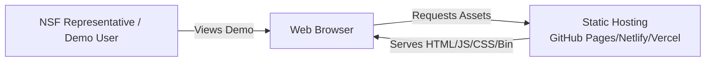
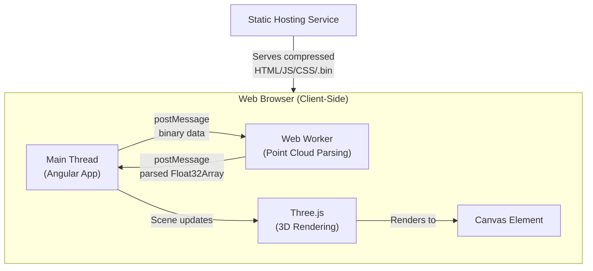
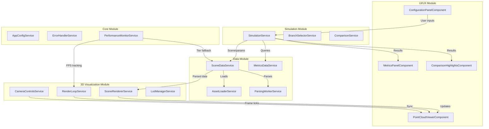
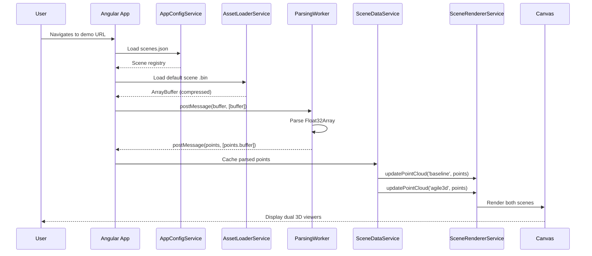
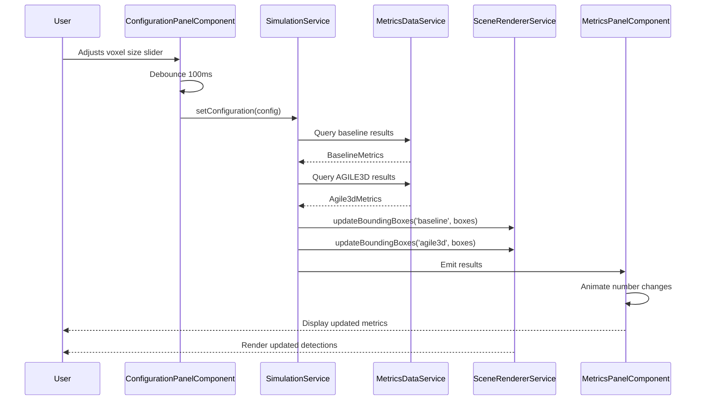
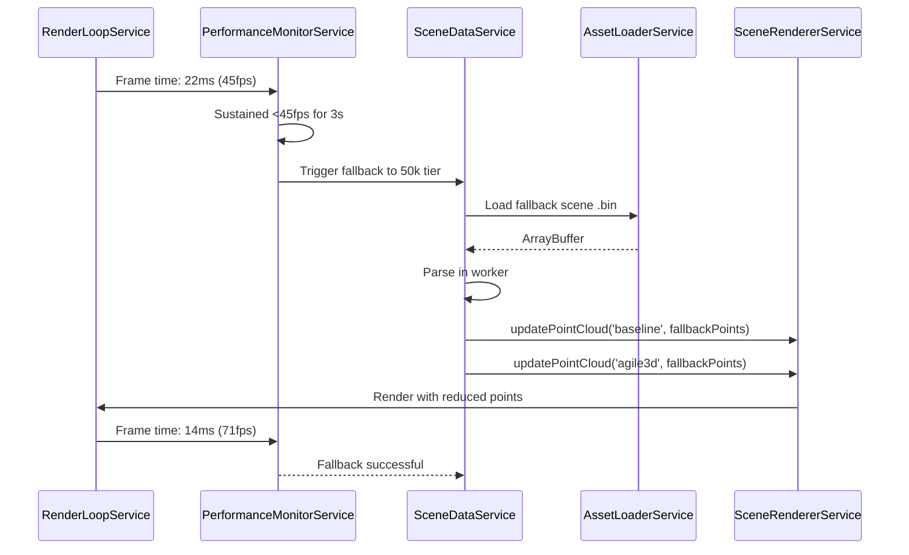
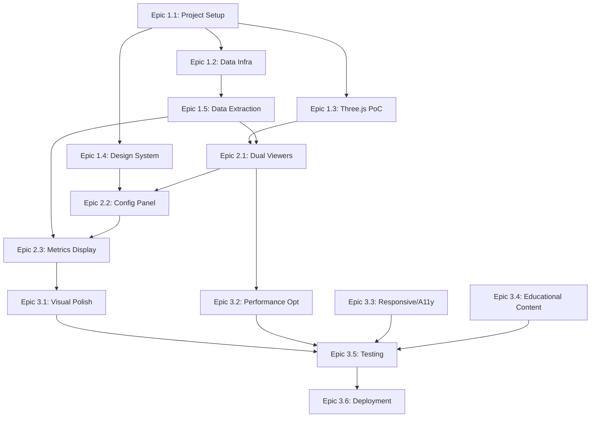
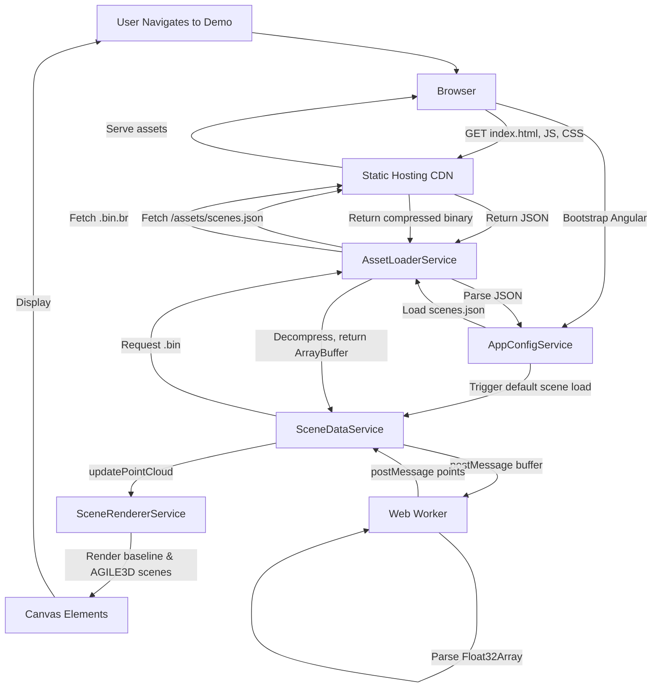

# AGILE3D Interactive Demo - Meso-Level Architecture & System Design

## Session Inputs Summary

**Macro-Level Plan**: AGILE3D Interactive Demo - Revised Macro Plan
- **Goal**: Build a focused comparison demo showing AGILE3D vs. baseline (DSVT-Voxel) algorithm side-by-side on the same 3D point cloud scenes
- **Target Audience**: NSF representatives
- **Key Features**: Dual synchronized 3D viewers, user-controllable parameters (scene type, spatial resolution, contention level, SLO), live metrics display, educational tooltips
- **Timeline**: 11-14 days across 3 phases

**Known Constraints**:
- Timeline: 2-week delivery window
- Performance: 60fps for 3D rendering, <100ms UI interactions, <5s initial load
- Asset budgets: Total 3D assets ≤8MB, per-scene ≤2.5MB (compressed)
- Target hardware: Demo-grade (≤100k points/scene) with fallback (≤50k points/scene)
- Browser compatibility: Modern browsers (Chrome, Firefox, Edge, Safari)
- Deployment: Static hosting (GitHub Pages, Netlify, Vercel)

**Known Non-Functional Requirements (NFRs)**:
- **Performance (NFR-1)**: 60fps 3D rendering, <100ms interaction response, <5s load time
- **Scalability (NFR-2)**: Graceful degradation to 50k-point scenes when <45fps sustained
- **Reliability (NFR-3)**: Stable, bug-free experience; no crashes or data loss
- **Maintainability (NFR-4)**: Extensible scene system (add new scenes via JSON config only)
- **Accessibility (NFR-5)**: WCAG AA color contrast, keyboard navigation, ARIA labels, respect prefers-reduced-motion
- **Observability (NFR-6)**: FPS counter, optional analytics tracking
- **Security (NFR-7)**: Client-side only, no user data collection beyond optional anonymous analytics

## Open Questions and Blocked Decisions

1. **Analytics Platform Selection**: Which analytics service (if any)? Google Analytics, Plausible, Fathom, or none?
   - **Blocks**: Final deployment configuration, privacy policy requirements
   - **Recommendation**: Defer until Phase 3; proceed without analytics for MVP

2. **Custom Domain**: Will a custom domain be used, or rely on hosting provider subdomain?
   - **Blocks**: DNS configuration, SSL setup
   - **Recommendation**: Proceed with hosting provider subdomain; custom domain is a post-deployment enhancement

3. **Paper Data Completeness**: Are all numerical values from Figures 7–15 and tables available?
   - **Blocks**: Decision Gate A (end Day 2)
   - **Mitigation**: Extract available data; flag gaps for synthetic interpolation or author consultation

4. **Advanced Controls Scope**: Should Phase 1 include only UI placeholders, or partial implementation?
   - **Blocks**: Phase 2 backlog prioritization
   - **Recommendation**: UI placeholders only in Phase 1; defer full implementation to Phase 2 stretch goals

---

## 1. Architecture Overview and Rationale

### Selected Architecture Pattern

**Pattern**: **Client-Side Modular Monolith with Web Worker Offloading**

**Justification**:
- **Client-side only**: The demo is a presentation tool with no backend persistence, authentication, or dynamic data generation. All data is pre-computed and shipped with the app.
- **Modular monolith**: Angular's module system and dependency injection naturally support a modular structure within a single deployable artifact. Given the 2-week timeline and single-team context, microservices would introduce unnecessary complexity.
- **Web Worker offloading**: Parsing binary point cloud data (Float32Array) is CPU-intensive and must not block the main thread. A dedicated parsing worker ensures smooth UI during asset loading.
- **Static hosting**: No server-side runtime required; the entire app is pre-built and served as static assets (HTML, JS, CSS, binary .bin files).

**Alternatives Considered**:
1. **Pure Main-Thread Monolith**:
   - Simpler but risks UI jank during asset parsing.
   - Rejected: Violates NFR-1 (60fps, <100ms interactions).
2. **Server-Side Rendering (SSR) or Static Site Generation (SSG)**:
   - Faster initial page load but adds build complexity and limited benefit for a single-page app with heavy client-side 3D rendering.
   - Rejected: Marginal SEO/load-time gains do not justify the added complexity for an NSF demo.
3. **Microservices / Backend API**:
   - Overkill for static demo data; introduces hosting costs, latency, and failure modes.
   - Rejected: No dynamic data or user state to manage.

**Alignment with Macro-Level Goals**:
- Supports real-time interactivity (NFR-1: <100ms UI response).
- Enables fast iteration and deployment (2-week timeline).
- Keeps hosting simple and cost-free (static hosting).
- Facilitates extensibility (NFR-4: JSON-driven scene config).

---

## 2. System Decomposition

### 2.1 High-Level Components

The system is decomposed into the following Angular modules and services:

#### **A. Core Infrastructure Module**
- **Responsibilities**: Application bootstrap, global state management, shared utilities, error handling.
- **Key Services**:
  - `AppConfigService`: Loads and validates app-wide configuration (scene registry, performance tiers, constants).
  - `ErrorHandlerService`: Centralized error logging and user-facing error messages.
  - `PerformanceMonitorService`: Tracks FPS, frame times; triggers tier fallback when <45fps sustained.

#### **B. Data Module**
- **Responsibilities**: Asset loading, parsing, caching, and scene data management.
- **Key Services**:
  - `AssetLoaderService`: Fetches binary .bin files (point clouds) and JSON metadata via `fetch()` with `arrayBuffer()`. Caches in-memory.
  - `ParsingWorkerService`: Manages Web Worker lifecycle; sends binary data via `postMessage(buffer, [buffer])` (Transferable); receives parsed `Float32Array` point clouds.
  - `SceneDataService`: Exposes scene catalog (vehicle-heavy, pedestrian-heavy, mixed) and orchestrates loading/parsing. Configuration-driven: scene types loaded from JSON.
  - `MetricsDataService`: Loads and indexes pre-computed metrics (baseline DSVT-Voxel and AGILE3D branch results) by (scene, voxelSize, contention, SLO).

#### **C. Simulation Module**
- **Responsibilities**: Business logic for parameter-to-results mapping, branch selection, and comparison calculations.
- **Key Services**:
  - `SimulationService`: Consumes user inputs (scene, voxelSize, contention, SLO) from configuration panel; queries `MetricsDataService`; emits baseline and AGILE3D results (accuracy, latency, violations, memory, active branch) as observables.
  - `BranchSelectorService`: Implements branch selection logic (maps user parameters to AGILE3D branch name, e.g., "CP-Pillar-0.32").
  - `ComparisonService`: Computes deltas (accuracy gain, latency improvement, violation reduction) and generates comparison highlights with color coding (green/amber/red).

#### **D. 3D Visualization Module**
- **Responsibilities**: Three.js scene setup, rendering, camera synchronization, and performance optimization.
- **Key Services**:
  - `RenderLoopService`: Owns the single `requestAnimationFrame` loop; emits frame ticks as observables. Components subscribe to render updates (avoids multiple RAF loops).
  - `SceneRendererService`: Creates and manages Two Three.js scenes (baseline and AGILE3D). Handles point cloud rendering (BufferGeometry with ShaderMaterial), bounding box rendering (instanced LineSegments), lighting, and camera setup.
  - `CameraControlsService`: Synchronizes OrbitControls across both 3D viewers. User input on one camera updates both.
  - `LodManagerService`: Implements level-of-detail (LOD) strategies: frustum culling, decimation when zoomed out, dynamic point-count capping to sustain 60fps.
- **Key Components**:
  - `PointCloudViewerComponent`: Wraps a Three.js scene (baseline or AGILE3D). Subscribes to `RenderLoopService` ticks and `SceneRendererService` updates.
  - `SyncedDualViewerComponent`: Container component holding two `PointCloudViewerComponent` instances with synchronized cameras.

#### **E. UI/UX Module**
- **Responsibilities**: User input controls, metrics display, tooltips, and layout.
- **Key Components**:
  - `ConfigurationPanelComponent`: Scene dropdown, voxel-size slider, contention slider (debounced 100ms), SLO slider (debounced 100ms), advanced controls toggle. Emits configuration changes to `SimulationService`.
  - `MetricsPanelComponent`: Displays baseline and AGILE3D metrics side-by-side. Subscribes to `SimulationService` results. Implements animated number counting and color highlights.
  - `ComparisonHighlightsComponent`: Shows accuracy gain, latency improvement, violation reduction with green/amber/red coding.
  - `TooltipDirective`: Provides explanatory tooltips on hover (ARIA-compliant).
  - `LoadingIndicatorComponent`: Displays progress during asset loading.

#### **F. Educational Content Module**
- **Responsibilities**: Static informational content (What is AGILE3D, Learn More sections).
- **Key Components**:
  - `IntroductionComponent`: Brief "What is AGILE3D?" section (minimal).
  - `LearnMoreComponent`: Expandable sections for deeper context (optional, collapsed by default).

### 2.2 Communication Styles

- **Synchronous (Request/Response)**:
  - `AssetLoaderService` fetches binary assets and JSON via `fetch()`.
  - `MetricsDataService` queries indexed data structures (synchronous lookup after initial load).
- **Asynchronous (Reactive Streams via RxJS Observables)**:
  - User input from `ConfigurationPanelComponent` → `SimulationService` → `SceneRendererService` and `MetricsPanelComponent` (BehaviorSubjects with `shareReplay(1)`, debounced where noted).
  - `RenderLoopService` frame ticks → `PointCloudViewerComponent` (frame-by-frame rendering).
  - `ParsingWorkerService` → `SceneDataService` (worker messages wrapped as observables).
- **Message Passing (Web Worker)**:
  - Main thread → Parsing Worker: `postMessage({action: 'parse', buffer: ArrayBuffer}, [buffer])` (Transferable).
  - Parsing Worker → Main thread: `postMessage({points: Float32Array}, [points.buffer])` (Transferable).

### 2.3 C4 Diagrams

#### C4 Context Diagram (Level 1)



#### C4 Container Diagram (Level 2)



#### C4 Component Diagram (Level 3 - Angular Modules)



---

## 3. Data and Interface Design

### 3.1 Domain Model and Key Entities

#### **Scene**
- **Attributes**:
  - `id`: string (unique identifier, e.g., "vehicle-heavy-001")
  - `name`: string (display name, e.g., "Vehicle-Heavy")
  - `pointCloudUrl`: string (relative path to .bin file)
  - `metadata`: SceneMetadata
    - `objectCounts`: { vehicles: number, pedestrians: number, cyclists: number }
    - `tier`: "demo" | "fallback" (100k vs 50k points)
    - `bounds`: { xMin, xMax, yMin, yMax, zMin, zMax }
- **Lifecycle**: Loaded from `scenes.json` config file; point cloud binary fetched on demand; cached in-memory until scene change.

#### **PointCloud**
- **Attributes**:
  - `points`: Float32Array (interleaved [x, y, z, x, y, z, ...])
  - `count`: number (total points)
- **Lifecycle**: Parsed in Web Worker; transferred to main thread via Transferable; stored in Three.js `BufferGeometry`.

#### **BoundingBox**
- **Attributes**:
  - `id`: string
  - `center`: { x, y, z }
  - `dimensions`: { width, height, depth }
  - `rotation`: { yaw }
  - `class`: "vehicle" | "pedestrian" | "cyclist"
  - `confidence`: number (0-1)
- **Lifecycle**: Generated by `SimulationService` based on scene and algorithm (baseline or AGILE3D); rendered as instanced LineSegments in Three.js.

#### **MetricsSnapshot**
- **Attributes**:
  - `algorithm`: "DSVT-Voxel" | "AGILE3D"
  - `accuracy`: number (mAP %)
  - `latency`: number (ms)
  - `violationRate`: number (%)
  - `memory`: number (GB)
  - `activeBranch?`: string (AGILE3D only)
- **Lifecycle**: Pre-computed, indexed by (scene, voxelSize, contention, SLO); looked up synchronously during simulation updates.

#### **Configuration**
- **Attributes**:
  - `sceneId`: string
  - `voxelSize`: number (0.16 | 0.24 | 0.32 | 0.48 | 0.64)
  - `contention`: number (0-100)
  - `slo`: number (100-500 ms)
  - `advanced?`: { encoding, detectionHead, featureExtractor } (optional)
- **Lifecycle**: Managed in `ConfigurationPanelComponent`; emitted as observable stream to `SimulationService`.

### 3.2 Core Schemas

#### **scenes.json** (Scene Registry)
```json
{
  "scenes": [
    {
      "id": "vehicle-heavy-001",
      "name": "Vehicle-Heavy",
      "pointCloudUrl": "/assets/scenes/vehicle-heavy-001.bin",
      "metadata": {
        "objectCounts": { "vehicles": 42, "pedestrians": 5, "cyclists": 2 },
        "tier": "demo",
        "bounds": { "xMin": -50, "xMax": 50, "yMin": -50, "yMax": 50, "zMin": -2, "zMax": 4 }
      }
    },
    ...
  ]
}
```

#### **metrics.json** (Pre-Computed Results)
```json
{
  "baseline": {
    "DSVT-Voxel": {
      "vehicle-heavy-001": {
        "0.32": {
          "0": { "accuracy": 72.5, "latency": 120, "violationRate": 2.3, "memory": 2.1 },
          "38": { "accuracy": 71.8, "latency": 145, "violationRate": 8.7, "memory": 2.1 },
          ...
        },
        ...
      },
      ...
    }
  },
  "agile3d": {
    "vehicle-heavy-001": {
      "0.32": {
        "0": { "accuracy": 74.2, "latency": 118, "violationRate": 1.9, "memory": 1.8, "branch": "CP-Pillar-0.32" },
        "38": { "accuracy": 73.5, "latency": 138, "violationRate": 5.2, "memory": 1.9, "branch": "CP-Pillar-0.32" },
        ...
      },
      ...
    }
  }
}
```

#### **Point Cloud Binary Format** (.bin files)
- **Encoding**: Little-endian Float32, stride 3
- **Structure**: `[x0, y0, z0, x1, y1, z1, ..., xN, yN, zN]`
- **Compression**: Pre-compressed with Brotli at build time; served with `Content-Encoding: br`
- **Access Pattern**: Streamed via `fetch(...).arrayBuffer()`; transferred to Web Worker; parsed and transferred back as `Float32Array`

### 3.3 Internal APIs and Interfaces

#### **AssetLoaderService API**
```typescript
interface AssetLoaderService {
  loadBinary(url: string): Observable<ArrayBuffer>;
  loadJSON<T>(url: string): Observable<T>;
  getLoadProgress(): Observable<{ loaded: number, total: number }>;
}
```

#### **ParsingWorkerService API**
```typescript
interface ParsingWorkerService {
  parsePointCloud(buffer: ArrayBuffer): Observable<Float32Array>;
}
```

#### **SimulationService API**
```typescript
interface SimulationService {
  setConfiguration(config: Configuration): void;
  getBaselineResults(): Observable<MetricsSnapshot>;
  getAgile3dResults(): Observable<MetricsSnapshot>;
  getComparison(): Observable<ComparisonHighlights>;
}
```

#### **SceneRendererService API**
```typescript
interface SceneRendererService {
  initializeScene(viewerId: 'baseline' | 'agile3d'): void;
  updatePointCloud(viewerId: string, points: Float32Array): void;
  updateBoundingBoxes(viewerId: string, boxes: BoundingBox[]): void;
  render(viewerId: string): void;
}
```

#### **CameraControlsService API**
```typescript
interface CameraControlsService {
  syncCameras(camera1: THREE.Camera, camera2: THREE.Camera): void;
  update(): void; // Called each frame
}
```

### 3.4 Data Flows and Key Sequences

#### **Sequence: Initial Load and Scene Rendering**



#### **Sequence: User Changes Configuration**



#### **Sequence: Performance Tier Fallback**



### 3.5 Storage and Caching

- **In-Memory Cache (Browser Runtime)**:
  - Parsed `Float32Array` point clouds cached in `SceneDataService` until scene change.
  - Metrics JSON loaded once at startup; indexed hash map for O(1) lookup.
- **Browser Cache (HTTP)**:
  - Static assets (.bin, .json, .js, .css) served with immutable cache headers: `Cache-Control: public, max-age=31536000, immutable`.
  - HTML served with: `Cache-Control: no-cache` (always revalidate for updates).
- **Compression**:
  - .bin files pre-compressed with Brotli at build time; served with `Content-Encoding: br`.
  - Fallback to gzip if Brotli unsupported by client.

### 3.6 Versioning and Error Handling

- **API Versioning**: Not applicable (no backend API; all data is statically versioned with app build).
- **Schema Versioning**: `scenes.json` and `metrics.json` include a `version` field (e.g., `"version": "1.0"`). `AppConfigService` validates version on load; displays error if mismatch.
- **Error Handling**:
  - Asset load failures: Display user-facing error message with retry button; log to `ErrorHandlerService`.
  - Parsing worker crashes: Restart worker; retry parse; fallback to placeholder scene if repeated failures.
  - Invalid configuration: Clamp sliders to valid ranges; log warning.
  - Low FPS: Automatic tier fallback (logged to `PerformanceMonitorService`); optional user notification.

---

## 4. Technology Choices and Rationale

### 4.1 Primary Technologies (Recommended)

| Layer                  | Technology                  | Rationale                                                                                                                                                                                                                                                                   | Alignment to Constraints/NFRs                                                                             |
|------------------------|-----------------------------|----------------------------------------------------------------------------------------------------------------------------------------------------------------------------------------------------------------------------------------------------------------------------|----------------------------------------------------------------------------------------------------------|
| **Framework**          | **Angular 17+**             | Macro-plan specifies Angular. Strong DI, RxJS integration, mature ecosystem. TypeScript provides type safety. CLI simplifies build/deploy.                                                                                                                                 | Timeline (2 weeks): Mature tooling accelerates development. NFR-4: Modular architecture.                 |
| **3D Rendering**       | **Three.js + angular-three (ngt)** | Macro-plan specifies Three.js with angular-three wrapper. Industry-standard WebGL library with extensive documentation. `ngt` provides Angular-friendly component wrappers and lifecycle management.                                                                        | NFR-1 (60fps): Hardware-accelerated WebGL. NFR-4: Component-based scene composition.                     |
| **State Management**   | **RxJS (BehaviorSubjects)** | Built into Angular; reactive streams with `shareReplay(1)` avoid redundant recomputations. Debouncing via `debounceTime(100)` on sliders. Simple mental model for this use case; no need for full NgRx/Akita.                                                              | NFR-1 (<100ms interactions): Debouncing prevents thrashing. Timeline: Lower learning curve than NgRx.   |
| **Web Worker**         | **Native Web Worker API**   | Standard browser API; no library overhead. Transferable ArrayBuffer avoids copy cost. Essential for non-blocking parsing.                                                                                                                                                  | NFR-1 (60fps, <100ms interactions): Offloads CPU-intensive parsing from main thread.                    |
| **Build Tool**         | **Angular CLI + esbuild**   | Angular CLI default (Webpack or esbuild). Esbuild (Angular 17+) offers faster builds. Supports tree-shaking, minification, Brotli compression.                                                                                                                             | Timeline (2 weeks): Fast iteration. Asset budgets (≤8MB): Tree-shaking and compression.                  |
| **Styling**            | **SCSS + Angular Material (optional)** | SCSS for maintainable styles with variables and mixins. Angular Material components (optional) for sliders, buttons, tooltips (WCAG-compliant out-of-box). Alternatively, Tailwind CSS for utility-first approach.                                                         | NFR-5 (accessibility): Material components include ARIA. Timeline: Pre-built components save time.      |
| **Testing**            | **Jasmine + Karma (unit), Cypress (e2e)** | Angular CLI defaults. Jasmine/Karma for unit tests. Cypress for end-to-end testing of UI flows (scene loading, slider interactions, camera sync).                                                                                                                          | NFR-3 (reliability): Comprehensive test coverage. Timeline: Familiar to Angular developers.              |
| **Deployment**         | **{GitHub_Pages | Netlify | Vercel}** | Static hosting with free tiers, CDN, automatic HTTPS, CI/CD integration (GitHub Actions, Netlify CLI, Vercel CLI). Brotli/gzip compression support.                                                                                                                        | Timeline (2 weeks): Zero-config deployment. Asset budgets: CDN caching and compression.                 |

### 4.2 Technology Alternatives and Trade-Offs

#### **3D Rendering Library**
| Option              | Pros                                                                 | Cons                                                              | Decision                                                                 |
|---------------------|----------------------------------------------------------------------|-------------------------------------------------------------------|--------------------------------------------------------------------------|
| **Three.js (ngt)**  | Macro-plan mandates; mature; extensive docs; Angular integration.    | Verbosity for low-level tasks.                                    | **Selected**: Aligned with macro-plan; proven for point cloud rendering. |
| Babylon.js          | Rich feature set; Unity-like API; strong performance.                | No explicit Angular wrapper; steeper learning curve.              | Rejected: Not specified in macro-plan; less Angular ecosystem support.   |
| WebGL (raw)         | Maximum control; minimal overhead.                                   | Months of development; complex camera/lighting setup.             | Rejected: Timeline infeasible; Three.js abstractions worth the cost.     |

#### **State Management**
| Option                  | Pros                                                                 | Cons                                                              | Decision                                                                 |
|-------------------------|----------------------------------------------------------------------|-------------------------------------------------------------------|--------------------------------------------------------------------------|
| **RxJS BehaviorSubjects** | Built-in; simple; sufficient for linear data flow (config → results). | Not ideal for complex state graphs; no time-travel debugging.     | **Selected**: Aligns with timeline; adequate for demo complexity.        |
| NgRx (Redux)            | Strong devtools; time-travel; testable reducers.                     | Boilerplate overhead; overkill for single-user demo.              | Rejected: Adds ~2 days to timeline for minimal benefit.                  |
| Akita                   | Simpler than NgRx; entity-based.                                     | Another library to learn; not needed for non-entity state.        | Rejected: Similar reason to NgRx; unnecessary for this use case.         |

#### **Styling Framework**
| Option                  | Pros                                                                 | Cons                                                              | Decision                                                                 |
|-------------------------|----------------------------------------------------------------------|-------------------------------------------------------------------|--------------------------------------------------------------------------|
| **Angular Material**    | WCAG-compliant components; cohesive design; fast implementation.     | Heavier bundle (~200KB); opinionated aesthetics.                  | **Recommended**: NFR-5 (accessibility); saves ~1 day vs custom components. |
| Tailwind CSS            | Utility-first; small bundle with PurgeCSS; design flexibility.       | Requires custom ARIA implementation; verbose HTML.                | Alternative: If custom design is priority; adds ~1 day for accessibility. |
| Custom SCSS             | Full control; minimal bundle size.                                   | Must implement all components from scratch; ~2-3 days overhead.   | Rejected: Timeline prohibitive unless design is critical differentiator. |

#### **Deployment Platform**
| Option              | Pros                                                                 | Cons                                                              | Decision                                                                 |
|---------------------|----------------------------------------------------------------------|-------------------------------------------------------------------|--------------------------------------------------------------------------|
| **GitHub Pages**    | Free; integrates with GitHub repo; simple.                           | Manual build step or GitHub Actions required.                     | **Option A**: Best if repo already on GitHub.                            |
| **Netlify**         | Drag-and-drop; automatic CI/CD; Brotli compression; branch previews. | Free tier limits (100GB bandwidth/month).                         | **Option B** (Recommended): Easiest setup; best DX; free tier sufficient. |
| **Vercel**          | Zero-config; edge caching; analytics (paid).                         | Angular support less mature than Next.js; free tier limits.       | **Option C**: Strong option if familiar with Vercel ecosystem.           |

**Final Recommendation**: **Netlify** for deployment (easiest CI/CD, Brotli support, branch previews for testing). **Angular Material** for styling (accessibility and timeline gains outweigh bundle size). **RxJS BehaviorSubjects** for state (simple, sufficient).

---

## 5. Integration Points

### 5.1 External Systems and Third-Party Services

| Integration               | Purpose                                         | Protocol/API         | Authentication | SLA/Quotas                     | Fallback Strategy                          |
|---------------------------|-------------------------------------------------|----------------------|----------------|--------------------------------|--------------------------------------------|
| **Static Hosting CDN**    | Serve HTML/JS/CSS/.bin assets                   | HTTPS (GET)          | None           | 99.9% uptime (typical CDN SLA) | Retry with exponential backoff; display offline message if persistent failure. |
| **Optional Analytics**    | Track page views, interaction events (anonymized) | HTTPS (POST)         | API key (optional) | Free tier: ~10k events/month   | Graceful degradation: fail silently if analytics unavailable; do not block app. |

### 5.2 Adapters and Gateways

- **Asset Gateway (`AssetLoaderService`)**:
  - Abstracts `fetch()` API for binary and JSON assets.
  - Handles retry logic (3 attempts with exponential backoff).
  - Emits load progress for UI progress bars.
  - Validates response headers (Content-Type, Content-Encoding).
- **Analytics Adapter (`AnalyticsService`, optional)**:
  - Wraps analytics SDK (e.g., Plausible, Google Analytics).
  - Implements privacy-respecting opt-in/out (respect DNT header).
  - Queues events if network unavailable; flushes on reconnect.

### 5.3 Data Mapping and Transformation

- **Binary to Float32Array** (in Web Worker):
  - Input: Little-endian Float32 binary ArrayBuffer.
  - Output: Float32Array with stride 3 ([x, y, z, ...]).
  - Validation: Check length is multiple of 12 bytes (3 floats × 4 bytes); reject malformed data.
- **Metrics JSON to Indexed Hash Map** (in `MetricsDataService`):
  - Input: Nested JSON structure (see schema in §3.2).
  - Output: Flattened hash map with composite key: `${algorithm}_${sceneId}_${voxelSize}_${contention}_${slo}`.
  - Enables O(1) lookup during simulation updates.

### 5.4 Idempotency and Error Retry

- **Asset Loading**:
  - Idempotent: `fetch()` requests can be retried safely (GET is idempotent).
  - Retry policy: 3 attempts, exponential backoff (500ms, 1s, 2s).
  - Error handling: After 3 failures, display user-facing error with manual retry button.
- **Worker Parsing**:
  - Idempotent: Same ArrayBuffer input always produces same Float32Array output.
  - Retry policy: If worker crashes, restart worker and retry parse once.
  - Error handling: After retry failure, fall back to placeholder scene (empty point cloud with error notification).

### 5.5 Quotas and Rate Limits

- **Static Hosting**:
  - Netlify free tier: 100GB bandwidth/month.
  - Mitigation: Pre-compress assets (Brotli); total bundle ≤8MB; ~10k page loads/month headroom.
- **Analytics (if enabled)**:
  - Plausible free trial: 10k page views/month.
  - Mitigation: Track only critical events (page load, scene change, config change); skip redundant events.

---

## 6. Deployment and Runtime Architecture

### 6.1 Environments

| Environment  | Purpose                          | Configuration Sources                       | Access               |
|--------------|----------------------------------|---------------------------------------------|----------------------|
| **Local Dev** | Development and testing          | `environment.dev.ts`, local JSON/binary files | Developer machines   |
| **Preview**   | Branch previews and QA           | `environment.preview.ts`, staging assets    | Netlify branch URLs  |
| **Production** | Public demo for NSF              | `environment.prod.ts`, optimized assets     | Custom domain or Netlify public URL |

### 6.2 Configuration Strategy

- **Angular Environments**:
  - `environment.dev.ts`: `{production: false, assetBaseUrl: '/assets', enableAnalytics: false}`
  - `environment.prod.ts`: `{production: true, assetBaseUrl: '/assets', enableAnalytics: true}`
- **Runtime Config** (`app-config.json`):
  - Loaded at startup by `AppConfigService`.
  - Contains scene registry, performance tier thresholds, feature flags.
  - Allows updates without rebuilding (swap JSON file on CDN).

### 6.3 Packaging and Deployment

- **Build Artifact**:
  - Angular CLI production build: `ng build --configuration=production`.
  - Output: `dist/agile3d-demo/` directory with:
    - `index.html`, `main.[hash].js`, `polyfills.[hash].js`, `styles.[hash].css`
    - `assets/scenes/*.bin.br` (pre-compressed Brotli)
    - `assets/config/*.json`
- **Pre-Compression**:
  - Brotli compression of .bin files via build script: `brotli -9 -o file.bin.br file.bin`.
  - Serve with `Content-Encoding: br` header (Netlify auto-detects .br files).
- **Deployment Strategy**:
  - **Blue-Green**: Netlify atomic deploys (new version published instantly; rollback via UI).
  - No canary needed (single-user demo, not multi-tenant service).

### 6.4 CI/CD Overview

- **Pipeline** (GitHub Actions or Netlify CI):
  1. **Trigger**: Push to `main` or pull request.
  2. **Build**:
     - Install dependencies: `npm ci`
     - Lint: `npm run lint`
     - Test: `npm run test:ci` (Jasmine/Karma headless)
     - Build: `npm run build:prod` (includes Brotli compression script)
  3. **Deploy**:
     - Preview: Deploy to Netlify branch preview (PR builds).
     - Production: Deploy to Netlify production URL (main branch).
  4. **Artifact Versioning**: Git commit SHA embedded in `environment.prod.ts` during build.
- **Branching Strategy**: Trunk-based development (main branch with short-lived feature branches; no GitFlow due to 2-week timeline).

### 6.5 Observability

#### **Logs**
- **Client-Side Logging**:
  - Console logs (debug builds): Verbose rendering stats, service lifecycle events.
  - Error logs (all builds): Captured by `ErrorHandlerService`; optionally sent to analytics (if enabled).
  - Log levels: `error`, `warn`, `info`, `debug` (configurable via environment).

#### **Metrics**
- **Performance Metrics** (tracked by `PerformanceMonitorService`):
  - FPS (smoothed over 60 frames): Displayed in overlay (optional, hidden by default).
  - Frame time (ms): Logged to console (debug builds).
  - Asset load times: Tracked by `AssetLoaderService`; logged on completion.
- **Optional Analytics Events**:
  - Page load, scene change, voxel size change, contention change, SLO change.
  - Aggregated by analytics service (no PII).

#### **Traces**
- Not applicable (client-side only; no distributed tracing).

#### **Dashboards and Alerting**
- **Development**:
  - Angular Augury DevTools for component inspection.
  - Chrome DevTools Performance tab for profiling rendering.
- **Production**:
  - Optional: Netlify Analytics dashboard (bandwidth, page views).
  - Optional: Analytics service dashboard (custom events).
- **Alerting**: Not applicable for demo (no uptime monitoring needed; Netlify handles infrastructure).

#### **SLO/SLA Hooks**
- **NFR-1 Performance SLOs**:
  - 60fps 3D rendering: Monitored by `PerformanceMonitorService`; fallback to 50k tier if <45fps sustained.
  - <100ms interaction response: Debouncing on sliders ensures smooth updates; no additional monitoring needed.
  - <5s load time: Validated during testing (asset budgets enforce this).

---

## 7. Non-Functional Requirements Mapping

| NFR                     | Target/Budget                                  | Architectural Mechanisms                                                                                                                                                                                                                 | Design Decisions                                                                                                                                                                                                     |
|-------------------------|------------------------------------------------|------------------------------------------------------------------------------------------------------------------------------------------------------------------------------------------------------------------------------------------|----------------------------------------------------------------------------------------------------------------------------------------------------------------------------------------------------------------------|
| **NFR-1: Performance**  | 60fps 3D, <100ms interactions, <5s load        | - Web Worker for parsing (non-blocking). <br>- Single RAF loop (RenderLoopService). <br>- Instanced rendering for bounding boxes. <br>- Frustum culling, LOD, decimation. <br>- Debounced sliders (100ms). <br>- Brotli compression. | - `PerformanceMonitorService` tracks FPS; triggers tier fallback. <br>- Asset budgets (≤8MB total, ≤2.5MB/scene) enforced in build. <br>- Cap devicePixelRatio to 1.5-2.0.                                         |
| **NFR-2: Scalability**  | Graceful degradation to 50k points <45fps      | - Tiered scene system (100k "demo", 50k "fallback"). <br>- Automatic tier fallback based on sustained FPS. <br>- Manual override via config.                                                                                            | - `SceneDataService` dynamically loads fallback scenes. <br>- FPS threshold: <45fps for 3 seconds triggers fallback.                                                                                                |
| **NFR-3: Reliability**  | Stable, bug-free; no crashes or data loss      | - Error boundaries in Angular (`ErrorHandlerService`). <br>- Retry logic for asset loading (3 attempts). <br>- Worker crash recovery (restart + retry). <br>- Comprehensive unit and e2e tests.                                          | - Test coverage: ≥80% for services, ≥70% for components. <br>- E2e tests for critical flows (scene load, slider interaction, camera sync).                                                                          |
| **NFR-4: Maintainability** | Extensible scene system (JSON-driven)          | - Configuration-driven architecture: `SceneDataService` loads scene catalog from `scenes.json`. <br>- Modular Angular services and components with clear boundaries. <br>- TypeScript for type safety.                                  | - Extensibility validation: Add 4th scene via JSON-only (no code changes) in Phase 1. <br>- Clear separation: Data (§2B), Simulation (§2C), Visualization (§2D), UI (§2E).                                         |
| **NFR-5: Accessibility** | WCAG AA, keyboard nav, ARIA, prefers-reduced-motion | - Angular Material components (ARIA-compliant out-of-box). <br>- Custom `TooltipDirective` with ARIA labels. <br>- Keyboard navigation for sliders and buttons. <br>- Respect `prefers-reduced-motion` for animations.                 | - Color contrast: All text ≥4.5:1 ratio (AA). <br>- Colorblind-safe palette (blue/red/orange bounding boxes + redundant labels). <br>- Reduced motion: Disable number counting animations if user preference set. |
| **NFR-6: Observability** | FPS counter, optional analytics                | - `PerformanceMonitorService` exposes FPS observable. <br>- Optional FPS overlay component (hidden by default). <br>- Optional `AnalyticsService` adapter for event tracking.                                                           | - FPS displayed via toggle in dev builds. <br>- Analytics: Privacy-respecting (no PII, respect DNT header), opt-in via config.                                                                                     |
| **NFR-7: Security**     | Client-side only, no user data collection      | - Static hosting (no server-side execution). <br>- No backend API (no auth, no user input beyond UI controls). <br>- Content Security Policy (CSP) headers on hosting.                                                                  | - CSP: `default-src 'self'; script-src 'self' 'unsafe-eval' (for Angular); style-src 'self' 'unsafe-inline'`. <br>- No cookies, no localStorage of user data.                                                       |

### 7.1 Explicit Gaps and Mitigations

- **NFR-1 (Performance) on Low-End Devices**:
  - Gap: 60fps may not be achievable on devices <5 years old with integrated GPUs.
  - Mitigation: Automatic fallback to 50k tier; document minimum recommended hardware (e.g., "Modern laptop with dedicated GPU recommended").
- **NFR-3 (Reliability) for Offline Use**:
  - Gap: Demo requires network access for initial load (no service worker for offline caching).
  - Mitigation: Display clear error message if offline; document requirement for online access.

---

## 8. Risks, Assumptions, and Open Questions

### 8.1 Top Risks

| Risk                                      | Likelihood | Impact | Mitigation                                                                                                                                                                                                     |
|-------------------------------------------|------------|--------|----------------------------------------------------------------------------------------------------------------------------------------------------------------------------------------------------------------|
| **Paper data incompleteness**             | Medium     | High   | Decision Gate A (end Day 2): Verify all metrics extractable from figures/tables. If gaps exist, synthesize interpolated values or consult paper authors. Flag synthetic data in UI (footnote).              |
| **Three.js performance bottleneck**       | Medium     | High   | Early PoC (Day 3 AM, Decision Gate B): Render 100k points and measure FPS. If <60fps on target hardware, optimize (instanced rendering, LOD) or reduce demo tier to 75k points.                              |
| **Worker parsing delay on large scenes**  | Low        | Medium | Validate parsing time <500ms for 100k points (Phase 1 Exit). If exceeded, optimize parser (SIMD, chunk-based parsing) or preload scenes during idle time.                                                    |
| **Camera sync complexity**                | Low        | Medium | PoC (Day 3 AM, Decision Gate B): Implement basic camera sync early. If drift occurs, enforce single OrbitControls instance with dual scene rendering (share camera state).                                   |
| **Accessibility compliance**              | Low        | Medium | Use Angular Material components (pre-validated WCAG AA). Run axe-core audits during Phase 3. Budget 1 day for remediation if violations found.                                                               |
| **Timeline slippage**                     | Medium     | High   | Daily standups with progress checks. Decision gates (A, B, Phase 1 Exit) enforce critical path validation. Phase 3 polish is lower priority; defer non-critical items (e.g., advanced controls, Learn More). |

### 8.2 Assumptions

| Assumption                                                                 | Validation Method                                                                 | Impact if Invalid                                                                                                                   |
|----------------------------------------------------------------------------|-----------------------------------------------------------------------------------|-------------------------------------------------------------------------------------------------------------------------------------|
| **Paper data is numerically extractable from figures 7–15 and tables.**   | Manual extraction and cross-check by end of Day 2 (Decision Gate A).             | High: Blocks metrics display. Mitigation: Synthesize or consult authors.                                                           |
| **Target hardware can sustain 60fps with 100k points.**                   | PoC on representative hardware (Day 3 AM, Decision Gate B).                       | High: Blocks demo tier. Mitigation: Reduce to 75k or 50k points.                                                                   |
| **Netlify free tier provides sufficient bandwidth (100GB/month).**        | Estimate: 8MB bundle × 10k page loads = 80GB. Monitor during Phase 3 deployment. | Medium: May incur costs. Mitigation: Switch to GitHub Pages or Vercel.                                                             |
| **Web Worker parsing is non-blocking and <500ms for 100k points.**        | Unit test with real .bin files (Phase 1 Exit).                                    | Medium: Blocks Phase 2 integration. Mitigation: Optimize parser or preload scenes.                                                  |
| **AGILE3D branch selection logic is deterministic and documented.**       | Cross-reference paper methodology; implement in `BranchSelectorService` by Day 5. | Medium: Blocks accurate metrics display. Mitigation: Simplify to predefined lookup table if logic is unclear.                      |
| **NSF representatives will access demo on modern browsers (Chrome/Edge).** | Test on Chrome, Firefox, Edge, Safari during Phase 3.                             | Low: May require polyfills. Mitigation: Add core-js polyfills for older browsers (adds ~50KB to bundle).                           |

### 8.3 Open Questions (from §0)

1. **Analytics Platform Selection**: Defer to Phase 3; proceed without analytics for MVP.
2. **Custom Domain**: Proceed with Netlify subdomain; custom domain is post-deployment.
3. **Paper Data Completeness**: Blocks Decision Gate A; validate by end of Day 2.
4. **Advanced Controls Scope**: UI placeholders only in Phase 1; defer implementation to Phase 2 stretch goals.

---

## 9. Traceability Matrix

| Macro-Level Goal                                                                 | Meso-Level Components                                                                                                     | Coverage Notes                                                                                                   |
|----------------------------------------------------------------------------------|---------------------------------------------------------------------------------------------------------------------------|------------------------------------------------------------------------------------------------------------------|
| **Side-by-side 3D point cloud visualization (Baseline vs AGILE3D)**             | `PointCloudViewerComponent` (§2D), `SceneRendererService` (§2D), `SyncedDualViewerComponent` (§2D)                       | Full coverage: Two viewers with synchronized cameras.                                                            |
| **Synchronized camera controls (orbit, zoom, pan)**                              | `CameraControlsService` (§2D)                                                                                             | Full coverage: Single OrbitControls logic replicated across both cameras.                                        |
| **Real-time updates based on configuration inputs**                              | `ConfigurationPanelComponent` (§2E), `SimulationService` (§2C), RxJS observables (§2)                                    | Full coverage: Debounced sliders → reactive pipeline → updated metrics and detections.                          |
| **Accurate representation of paper's data and findings**                         | `MetricsDataService` (§2B), `SimulationService` (§2C), `BranchSelectorService` (§2C)                                     | Partial coverage: Blocks Decision Gate A (paper data extraction). Validation required by end of Day 2.           |
| **Smooth performance (60fps for 3D, <100ms for interactions)**                   | `RenderLoopService` (§2D), `LodManagerService` (§2D), `PerformanceMonitorService` (§2A), Web Worker parsing (§2B)        | Full coverage: RAF loop, instanced rendering, LOD, worker offloading, tier fallback.                             |
| **Clear visual differentiation between baseline and AGILE3D performance**        | `MetricsPanelComponent` (§2E), `ComparisonHighlightsComponent` (§2E)                                                     | Full coverage: Side-by-side metrics, comparison highlights with color coding.                                    |
| **Intuitive controls requiring minimal explanation**                             | `ConfigurationPanelComponent` (§2E), `TooltipDirective` (§2E)                                                            | Full coverage: Sliders with labels, tooltips on hover.                                                           |
| **Professional, polished appearance**                                            | Angular Material styling (§4), `LoadingIndicatorComponent` (§2E), animation standards (Phase 3)                          | Full coverage: Deferred to Phase 3 (visual polish).                                                              |
| **Loads in <5 seconds on modern hardware**                                       | Brotli compression (§3.5, §6.3), asset budgets (≤8MB), lazy loading (Phase 3)                                            | Full coverage: Asset budgets enforced; validated in Phase 3 testing.                                             |
| **Extensible scene system (add scenes via JSON config only)**                    | `SceneDataService` (§2B), `scenes.json` schema (§3.2)                                                                    | Full coverage: Extensibility validation in Phase 1 (add 4th scene JSON-only).                                    |
| **Educational content (tooltips, "What is AGILE3D?")**                           | `IntroductionComponent` (§2F), `LearnMoreComponent` (§2F), `TooltipDirective` (§2E)                                      | Full coverage: Deferred to Phase 3 (educational content implementation).                                         |
| **Responsive design (desktop, tablet)**                                          | Responsive breakpoints (§1.3 Macro), Angular Flex Layout or CSS Grid (Phase 3)                                           | Full coverage: Deferred to Phase 3 (responsive design).                                                          |
| **Accessibility (WCAG AA, keyboard nav, ARIA, colorblind-safe, reduced motion)** | Angular Material (§4), `TooltipDirective` (§2E), colorblind-safe palette (§7), prefers-reduced-motion support (§7)      | Full coverage: Angular Material provides ARIA; custom components validated with axe-core in Phase 3.             |

### 9.1 Coverage Gaps and Mitigations

- **Gap: Paper Data Extraction (Decision Gate A)**
  - **Coverage**: Partial (schema defined, services stubbed).
  - **Mitigation**: Manual extraction by end of Day 2; validate completeness before Phase 2 integration.
- **Gap: Advanced Controls Implementation**
  - **Coverage**: UI placeholders only (Phase 1).
  - **Mitigation**: Defer to Phase 2 stretch goals; not critical for MVP.

---

## 10. Readiness for Micro-Level Planning

### 10.1 Prioritized Implementation Workstreams

#### **Workstream 1: Foundation (Phase 1)**
- **Epics**:
  1. **Epic 1.1: Project Setup & Core Services**
     - Tasks: Initialize Angular project, configure build, scaffold modules, implement `AppConfigService`, `ErrorHandlerService`, `PerformanceMonitorService`.
     - Milestone: Services injectable and tested (end of Day 1).
  2. **Epic 1.2: Data Infrastructure (Worker-First)**
     - Tasks: Implement `AssetLoaderService`, `ParsingWorkerService`, `SceneDataService`, create Web Worker for parsing, validate zero-copy transfer.
     - Milestone: Worker parses dummy .bin file non-blocking (end of Day 2).
  3. **Epic 1.3: Three.js PoC**
     - Tasks: Integrate angular-three, render 100k points with camera sync, measure FPS on target hardware.
     - Milestone: Decision Gate B (Day 3 AM): 60fps achieved with camera sync.
  4. **Epic 1.4: Design System**
     - Tasks: Define color scheme, typography, Angular Material theme (or Tailwind config), create layout wireframes.
     - Milestone: Style guide documented (end of Day 2).
  5. **Epic 1.5: Data Extraction & Scene Preparation**
     - Tasks: Extract metrics from paper figures/tables, create `scenes.json` and `metrics.json`, generate synthetic .bin files, pre-compress with Brotli, validate extensibility (add 4th scene JSON-only).
     - Milestone: Decision Gate A (end of Day 2): Paper data validated; Phase 1 Exit: Extensibility validated, budgets met, worker parsing verified (end of Day 4).
- **Entry Criteria**: Macro-plan approved, development environment set up, paper PDF accessible.
- **Exit Criteria**: Phase 1 Exit milestone achieved (extensibility validation, budgets met, worker parsing verified).

#### **Workstream 2: Core Demo (Phase 2)**
- **Epics**:
  1. **Epic 2.1: Dual 3D Viewers**
     - Tasks: Build `PointCloudViewerComponent`, `SyncedDualViewerComponent`, `SceneRendererService`, implement point cloud rendering (BufferGeometry + ShaderMaterial), bounding box rendering (instanced LineSegments), integrate `CameraControlsService`, implement `LodManagerService`.
     - Milestone: Both viewers render same scene with detections and sync cameras (end of Day 7).
  2. **Epic 2.2: Configuration Panel**
     - Tasks: Build `ConfigurationPanelComponent`, wire up sliders (voxel size, contention, SLO) with debouncing, scene dropdown, advanced controls toggle (UI only), connect to `SimulationService`.
     - Milestone: Config changes trigger simulation updates (end of Day 9).
  3. **Epic 2.3: Metrics Display**
     - Tasks: Build `MetricsPanelComponent`, `ComparisonHighlightsComponent`, implement animated number counting, color-coded highlights, connect to `SimulationService` results.
     - Milestone: Metrics update in real-time with config changes (end of Day 10).
- **Entry Criteria**: Phase 1 Exit criteria met.
- **Exit Criteria**: All functional requirements (side-by-side viewers, synchronized cameras, real-time updates, metrics display) operational.

#### **Workstream 3: Polish & Deployment (Phase 3)**
- **Epics**:
  1. **Epic 3.1: Visual Polish**
     - Tasks: Implement entrance animations, loading states, micro-interactions, tooltips.
     - Milestone: UI feels responsive and polished (end of Day 11).
  2. **Epic 3.2: Performance Optimization**
     - Tasks: Optimize rendering (LOD, frustum culling, decimation), cap devicePixelRatio, add FPS counter, validate <5s load time.
     - Milestone: 60fps sustained on target hardware (end of Day 12).
  3. **Epic 3.3: Responsive Design & Accessibility**
     - Tasks: Implement responsive breakpoints, keyboard navigation, ARIA labels, run axe-core audit, fix violations.
     - Milestone: WCAG AA compliance validated (end of Day 12).
  4. **Epic 3.4: Educational Content**
     - Tasks: Implement `IntroductionComponent`, `LearnMoreComponent`, tooltips with explanations.
     - Milestone: Content concise and accurate (end of Day 13).
  5. **Epic 3.5: Testing & Validation**
     - Tasks: Unit tests (≥80% coverage for services, ≥70% for components), e2e tests (Cypress: scene load, slider interaction, camera sync), test on Chrome/Firefox/Edge/Safari.
     - Milestone: All tests passing, no critical bugs (end of Day 13).
  6. **Epic 3.6: Deployment**
     - Tasks: Configure Netlify, enable Brotli, set cache headers, deploy to production, smoke test.
     - Milestone: Demo live at public URL (end of Day 14).
- **Entry Criteria**: Phase 2 Exit criteria met.
- **Exit Criteria**: Demo deployed, accessible, stable, and validated with target audience (NSF representative or proxy).

### 10.2 Dependencies and Sequencing



### 10.3 Critical Path

1. Epic 1.1 (Project Setup) → Epic 1.2 (Data Infra) → Epic 1.3 (Three.js PoC) → Epic 2.1 (Dual Viewers) → Epic 2.2 (Config Panel) → Epic 2.3 (Metrics Display) → Epic 3.5 (Testing) → Epic 3.6 (Deployment).
2. **Parallelization**: Epic 1.4 (Design System) and Epic 1.5 (Data Extraction) can run in parallel with Epic 1.2 and 1.3 after Epic 1.1 completes.
3. **Decision Gates**:
   - Gate A (end Day 2): Epic 1.5 milestone (paper data completeness).
   - Gate B (Day 3 AM): Epic 1.3 milestone (60fps + camera sync).
   - Phase 1 Exit (end Day 4): Epic 1.5 milestone (extensibility, budgets, worker parsing).

### 10.4 Definition of Ready for Micro-Level Planning

A workstream/epic is ready for micro-level planning (story breakdown, acceptance criteria, task decomposition) when:
1. **Macro-level requirements are clear**: Functional and non-functional requirements are documented and validated.
2. **Dependencies are resolved**: Prior epics' exit criteria are met; no blocking open questions.
3. **Technical approach is agreed**: Architecture, data models, and interfaces are defined (this meso-level plan).
4. **Design artifacts are available** (for UI epics): Wireframes, style guide, or component mockups exist.
5. **Test strategy is defined**: Unit, integration, and e2e test scope is clear.

**Current Status**: Workstreams 1 and 2 are ready for micro-level planning. Workstream 3 is ready for high-level planning; detailed stories deferred until Phase 2 completion.

---

## 11. Diagrams

### 11.1 C4 Context Diagram
(See §2.3 above)

### 11.2 C4 Container Diagram
(See §2.3 above)

### 11.3 C4 Component Diagram
(See §2.3 above)

### 11.4 Data Flow Diagram: Initial Load



### 11.5 Sequence Diagram: Configuration Change Flow
(See §3.4 above)

### 11.6 Sequence Diagram: Performance Tier Fallback
(See §3.4 above)

---

## 12. Out of Scope for Meso-Level

The following items are deferred to micro-level planning or are explicitly out of scope:

1. **Code-Level Design**:
   - Class-level implementation details (e.g., private methods, internal state).
   - Function signatures and parameter types (documented at micro-level in TypeScript interfaces).
   - Algorithm pseudocode (e.g., branch selection heuristic internals).
2. **Test Case Specifications**:
   - Unit test cases (test descriptions, arrange/act/assert logic).
   - E2e test scripts (Cypress command sequences).
   - Defer to micro-level task breakdown.
3. **Detailed Acceptance Criteria**:
   - User story-level acceptance criteria (e.g., "Given scene is vehicle-heavy, when user sets voxel size to 0.32, then accuracy is X.X%").
   - Defer to micro-level story grooming.
4. **Environment-Specific Secrets and Configuration Minutiae**:
   - Analytics API keys (if enabled): Managed in Netlify environment variables.
   - CDN-specific cache header syntax: Documented in deployment guide (micro-level).
5. **Third-Party Library Version Pinning**:
   - Specific versions (e.g., "Three.js 0.160.0") documented in `package.json` at micro-level.
   - Meso-level specifies library choice, not version.

---

## Summary

This meso-level plan provides a complete, grounded architecture and system design for the AGILE3D Interactive Demo, aligned with the macro-level plan and declared constraints/NFRs. It defines:
- A modular Angular architecture with Web Worker offloading for performance.
- Clear component decomposition with reactive data flows (RxJS).
- Data models, schemas, and interfaces for scenes, metrics, and configuration.
- Technology choices (Angular 17+, Three.js, angular-three, RxJS, Angular Material, Netlify) with trade-offs and rationale.
- NFR coverage (60fps, <100ms interactions, <5s load, accessibility, extensibility, observability).
- Deployment strategy (static hosting, CI/CD, Brotli compression).
- Risk mitigation (decision gates, extensibility validation, performance PoC).
- Traceability from macro goals to meso components.
- Readiness for micro-level planning (epics, milestones, dependencies, critical path).

**Next Steps**: Proceed to micro-level planning for Workstream 1 (Foundation) after validating this plan with stakeholders.
