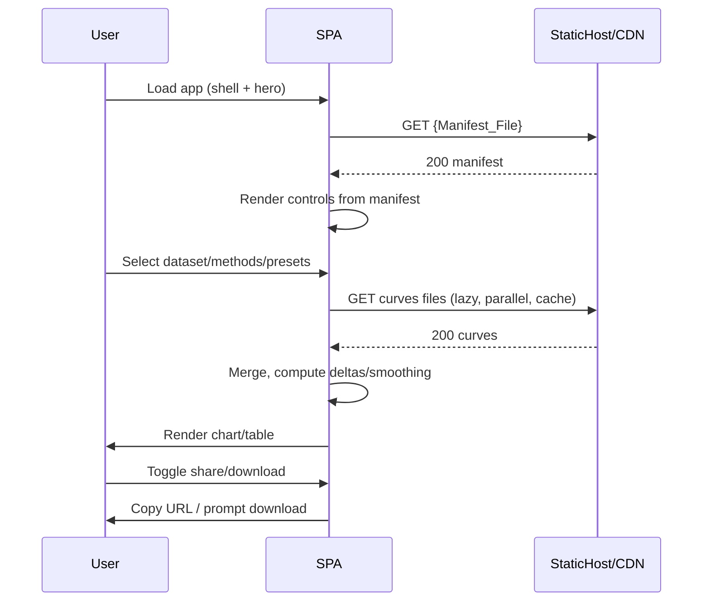
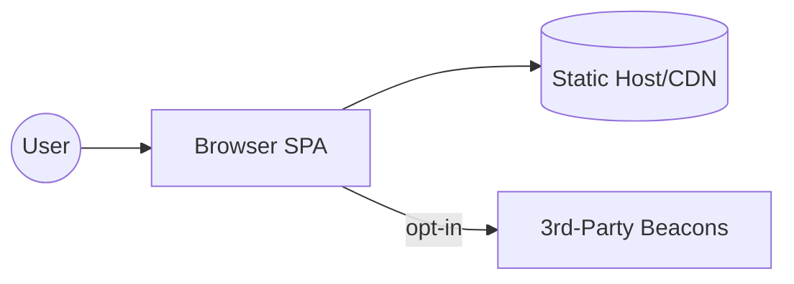
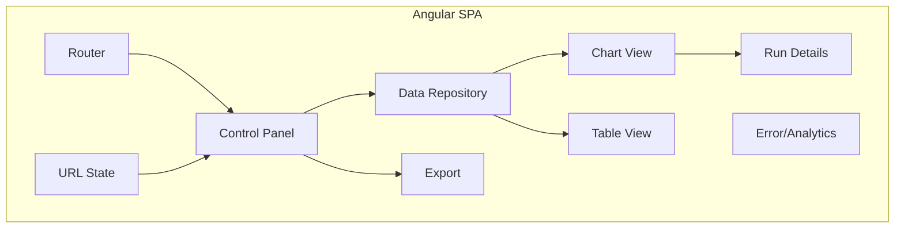
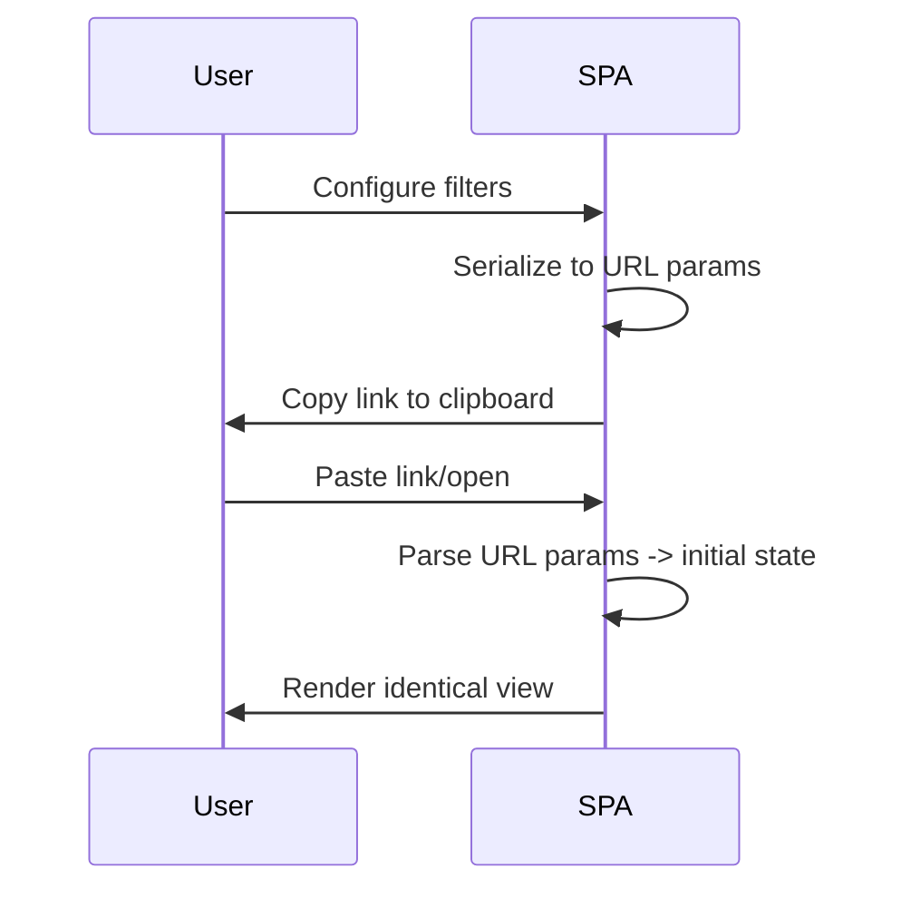

Session Inputs Restatement
- Macro-Level Plan Summary: Build a static, no-backend {Project_Name} Results Explorer with a 3-step hero and an interactive explorer to compare {Primary_Method} presets versus {Baseline_Methods} using Accuracy vs Edges per Round (MVP), with optional Latency and Rounds-to-Target (Phase 2). Data is precomputed and shipped as static artifacts with provenance for client-only rendering, shareable URLs, and downloads.
- Known Constraints: Static hosting; no server-side state; initial bundle < 1 MB; TTI < 2 s; chart interactivity < 50 ms on toggle; 60 fps animations with reduced-motion support; strict accessibility (keyboard/ARIA/contrast); no tracking by default; optional privacy-friendly analytics via explicit toggle; client-side error reporting via beacon; visible data provenance.
- Known NFRs: Performance budgets; accessibility; privacy-by-default; simple operability; maintainability/extensibility. Note: Scalability is not a goal (low, intermittent academic use); prioritize simplicity over scale.

Open Questions and Blocked Decisions
- Baselines & Scope: Final baseline list and whether federated variants are included; definition of “edges/round” parity across methods. Blocks: delta computation rules, legend defaults.
- Presets: Canonical preset names and parameter mappings ({Param_1|Param_2|Param_3|Param_4|Param_5}); global vs dataset-specific presets. Blocks: preset resolver logic and tooltips.
- Metrics: Datasets with latency; default targets for rounds-to-X%; precision/rounding standards. Blocks: chart axis config and table formatting.
- Multi-dataset Behavior: Overlay vs faceting vs tabs; default behavior. Blocks: chart layout and data load strategy.
- “Best Baseline” Definition: Candidate set, tie-breaking, interpolation for misaligned x-grids. Blocks: delta calculations and tooltip content.
- Smoothing: Algorithm choice and parameters; scope (x, y, or both); UI affordance. Blocks: compute path and performance budget.
- Data Packaging & Versioning: Directory structure, naming, manifest fields, versioning strategy; include version in share URLs? Blocks: loader contracts and cache headers.
- Observability & Privacy: Beacon endpoint/provider (without backend), error taxonomy; optional analytics provider and toggle UX. Blocks: consent gating and data handling.
- Hosting & CI/CD: Chosen static host/CDN, cache headers for data, invalidation policy. Blocks: deployment config and cache strategy.
- Browser Support & Responsiveness: Minimum versions and mobile targets. Blocks: polyfills and CSS strategy.

1. Architecture Overview and Rationale
- Selected Pattern: Client-side SPA with static hosting (JAMStack) using Angular for the web UI; modular, layered front-end architecture; data served as immutable static artifacts; optional third-party beacons behind a user toggle.
- Rationale: Meets “no-backend” constraint; keeps operational footprint minimal; supports code-splitting and prerender for fast TTI; simple to host anywhere; Angular enforces structure, accessibility, and testability. Given low, intermittent usage, we avoid complexity aimed at high scale.
- Alternatives and Trade-offs:
  - {Web_Framework_Option_A}: Smaller runtime and fast cold start; less opinionated—may increase maintenance risk for complex state.
  - {Web_Framework_Option_B}: Flexible ecosystem; risk of bundle entropy without strong conventions; additional libs for patterns.
  - {Static_Site_Generator_Option}: Strong for content and prerender; adds indirection for dynamic chart interactions.
  - Chosen (mandated): Angular for website work.
- Alignment: Satisfies performance budgets (prerender + lazy load), accessibility (built-in patterns), privacy-by-default (no SSR tracking), maintainability (typed, modular), and simplicity (no servers, minimal infra).

2. System Decomposition
- Modules/Components
  - App Shell: Routing, theming, global layout (Header, Footer), reduced-motion handling, consent toggle.
  - Hero Module: 3-step visual with SVG/animation honoring prefers-reduced-motion; accessible narration.
  - Explorer Module:
    - Control Panel: Dataset(s), Metric group, Methods, Presets, Display options (deltas, smoothing, x-scale), Share/Download.
    - Chart View: Multi-series line chart; hover/tooltip; legend toggles; focus/highlight; variance bands (Phase 2).
    - Table View: Flattened runs; sortable; consistent with chart selection.
    - Run Details Panel: Config, edges breakdown, seeds/variance, provenance, link to raw slice.
  - Data Layer:
    - Manifest Loader: Fetch/validate {Manifest_File} describing datasets, metrics, methods, presets, and file locations.
    - Curves Repository: Lazy-load per dataset+metric files; map/merge series; interpolate as configured; cache in-memory.
    - URL State Service: Encode/decode shareable state; sync with router.
  - Observability:
    - Error Beacon Service: Collect client errors and send via navigator.sendBeacon to {Error_Provider}; opt-in only.
    - Provenance Surface: Display source, checksum, and version.
  - Accessibility & Theming: Color palettes (color-blind safe), high contrast, keyboard focus order, ARIA labeling.
- Communication Styles: Intra-browser sync method calls; async fetch for JSON/CSV; optional async beacons; no server RPCs.
- C4 Views (Mermaid)
```mermaid path=null start=null
flowchart TB
User((User))
subgraph Browser[SPA (Angular)]
  Shell[App Shell]
  Hero[Hero Module]
  Explorer[Explorer Module]
  Data[Data Layer]
  Obs[Observability]
end
CDN[(Static Host/CDN)]
Analytics[Optional Third-Party Beacons]
User --> Browser
Browser -->|fetch manifest/curves| CDN
Browser -->|opt-in beacons| Analytics
```

3. Data and Interface Design
- Domain Model
  - Dataset {Dataset_ID, label, tags}
  - Metric {Metric_ID, label, unit, axis: {x|y}}
  - Method {Method_ID, type: {Primary|Baseline}, colorKey}
  - Preset {Preset_ID, label, params: {Param_1..Param_N}, scope: {global|per-dataset}}
  - Series {datasetId, metricId, methodId, presetId?, variant?, points: [CurvePoint], variance?}
  - CurvePoint {x, y, xUnit?, yUnit?, n?, seed?, ciLo?, ciHi?}
  - Provenance {source, license, checksum, createdAt, version}
- Schemas (outline)
  - {Manifest_File}
    - version: string
    - datasets: Dataset[]
    - metrics: Metric[]
    - methods: Method[]
    - presets: Preset[]
    - seriesIndex: [{ datasetId, metricId, methodId, presetId?, file: {Public_Data_Path}/... }]
  - Curves File
    - header: { datasetId, metricId, methodId, presetId?, xLabel, yLabel, units?, provenance }
    - points: CurvePoint[]
- Storage & Indexing
  - Artifacts chunked per dataset+metric (or aggregated if small) to cap fetch size; filenames may include content hash and version; leverage basic CDN caching but keep configuration simple.
  - In-browser index over seriesIndex for fast filtering; memoized map of keys → loaded data; optional Web Worker for smoothing if CPU-bound.
- Lifecycle/Retention
  - Immutable versioned artifacts; new versions co-exist; manifest points to latest; share URLs can include dataVersion for reproducibility.
- APIs & Interfaces
  - Internal: DataRepository API (getManifest, getCurves({datasetId, metricId, methodId, presetId})), URLState API (encode/decode), Export API (toCSV/toJSON/toPNG), Observability API (captureError, consent toggle).
  - External: Optional beacon endpoint (HTTPS, CORS allowed); no other external APIs.
  - Versioning: Manifest.version; artifact filenames with semantic/timestamp versions; optional URL param dataVersion.
  - Authn/Z: None for browsing/download; explicit consent gate for beacons/analytics.
  - Errors: Network failures → UI to retry; schema validation errors → surfaced in console + non-blocking toast; idempotent beacons.
  - Rate Limits: Not applicable (static); light debounce on interactions.
- Data Flows (Mermaid)


4. Technology Choices and Rationale
- Primary Runtime/Framework
  - Angular (mandated for website): strong structure, built-in accessibility patterns, robust routing, prerender options, TypeScript-first.
- Charting Options
  - {Charting_Option_A}: Very small footprint; excellent performance; limited built-in export; needs custom a11y aids.
  - {Charting_Option_B}: Rich features and exports; moderate bundle; accessible defaults; tree-shakeable.
  - {Charting_Option_C}: Declarative grammar; expressive; heavier; good accessibility; lazy-load recommended.
  - Recommendation: {Charting_Option_B} for balance of features and size; lazy-load chart module to protect initial <1 MB budget. Use {Charting_Option_A} if budgets become tight.
- Build/Packaging
  - Angular builder with code-splitting; prerender shell/hero; brotli/gzip assets.
- Persistence/Storage
  - Static artifacts on {Static_Host_A|Static_Host_B|Static_Host_C}; no client persistence beyond memory; optional simple service worker for offline viewing is deferred.
- Search
  - In-memory filter/sort only.
- Messaging/Streaming
  - None (no backend). Optional beacon API for errors.
- Integration Approach
  - ESM, tree-shaking; dynamic imports for charting/data utilities; URL state drives app initialization.

5. Integration Points
- External Systems
  - Error Reporting: {Error_Provider_A|B}; HTTPS; sendBeacon; best-effort only; fallback: console logs.
  - Optional Analytics: {Privacy_Analytics_Provider_A|B}; consent-gated; minimal.
  - Optional URL Shortening: {Shortlink_Provider_A|B} if needed; likely unnecessary for intermittent use.
- Authn/Z
  - None for core features; consent stored in local storage.
- Fallback Strategies
  - If endpoints fail, silently degrade; retries with backoff for beacons; idempotency via event hash.
- Data Mapping/Transformation
  - Validate schemas on load; normalize units; deterministic interpolation (if enabled) flagged in UI.

6. Deployment and Runtime Architecture
- Environments
  - Dev → Preview → Prod; environment variables baked at build time; feature flags for Phase 2 features.
- Packaging & Deployment
  - Static bundle; host on a simple static service or CDN; atomic uploads to ensure consistency; preview links for review.
- Caching Strategy
  - App assets: hashed filenames, immutable caching.
  - Data: versioned paths; long TTL for versioned files; short TTL for manifest. Keep caching configuration minimal.
- CI/CD
  - Trunk-based with PRs; CI stages: lint/typecheck, unit tests, schema validation of data, build, bundle-size guard, checksum logging, Lighthouse budget check, deploy to preview, promote to prod.
- Observability
  - Logs: console with levels; Performance marks (TTI, chart toggle latency); if consented, send summarized metrics via beacon; no tracing.

7. Non-Functional Requirements Mapping
- Performance: Prerender shell; code-splitting; lazy-load charting; brotli; minimal polyfills; memoization; optional Web Worker for smoothing; CI budget gates.
- Scalability: Not a priority; static hosting suffices; no special scale mechanisms.
- Availability/Reliability: Static host uptime adequate; no single dynamic dependency; graceful degradation without external beacons.
- Security/Privacy: HTTPS; no tracking by default; CSP restricting script origins; consent-gated optional analytics; no PII; provenance displayed.
- Accessibility: Keyboard-first flows; ARIA labels; color-blind safe palettes; high-contrast mode; reduced-motion; focus management.
- Maintainability: Typed contracts for manifest/curves; modular Angular feature modules; lint rules; documentation for data packaging.
- Operability: Simple deploy pipeline; visible versioning of data and app; minimal external dependencies.

8. Risks, Assumptions, and Open Questions
- Risks
  - Charting library size jeopardizes <1 MB budget. Mitigation: lazy-load and prefer {Charting_Option_A|B}.
  - Data file sizes slow initial interactions. Mitigation: chunk by dataset+metric; compress; load-on-demand.
  - Delta computation ambiguity leads to inconsistent displays. Mitigation: formal spec and tests before implementation.
  - Accessibility regressions. Mitigation: automated a11y checks and manual reviews.
- Assumptions
  - Data can be precomputed to avoid heavy client-side processing; datasets are modest when chunked.
  - Long URLs acceptable; shortlink optional.
- Open Questions: See “Open Questions and Blocked Decisions.”

9. Traceability Matrix
- 3-step hero → Hero Module; prerendered for fast TTI; reduced motion.
- Results Explorer (datasets, methods, presets) → Explorer Module (Control Panel, Chart View, Table View) + Data Layer.
- Deltas vs best baseline → Curves Repository (delta engine) + tooltip formatting.
- Run Details → Run Details Panel + provenance.
- Download/Share → Export API + URL State Service.
- Performance budgets → Build pipeline (code-splitting, budgets) + CI gates.
- Accessibility → Theming/ARIA + keyboard navigation.
- Privacy/Observability → Consent gate + Error Beacon Service + provenance surface.

10. Readiness for Micro-Level Planning
- Workstreams/Epics (priority order)
  1) Data Contracts & Packaging: finalize schemas, manifest, versioning; sample artifacts; CI validation.
  2) Angular App Shell & Theming: routing, layout, reduced-motion, palettes, contrast mode.
  3) Data Layer: manifest loader, repository, URL state; caching; validation.
  4) Charting Integration: choose {Charting_Option}; lazy-load module; tooltip/legend interactions; performance tuning.
  5) Explorer UI: controls, chart/table orchestration, presets resolver; delta calc.
  6) Export & Share: CSV/JSON export; PNG export; URL encode/decode; clipboard.
  7) Run Details & Provenance: panel UI; link to raw slices; checksums.
  8) Observability & Privacy: error beacon (opt-in), optional analytics, consent gate.
  9) Phase 2 Metrics: latency, rounds-to-target; variance bands.
- Entry/Exit Criteria
  - Each epic: Design doc + contracts ready; unit tests; performance budget checks; accessibility checklist; demo in preview env.
- Dependencies & Critical Path
  - Data Contracts → Data Layer → Explorer/Charting → Export/Share → Observability.
- Definition of Ready
  - Decisions for baseline list, presets, smoothing, data versioning, and hosting captured; acceptance tests per epic.

11. Diagrams (as needed)
- C4 Context

- Container View (simplified)

- Sequence: Shareable URL


12. Out of Scope for Meso-Level
- Code-level design (classes/functions), concrete component APIs, and test cases.
- Story-level acceptance criteria and UX microcopy.
- Environment-specific secrets and per-service configuration minutiae.
